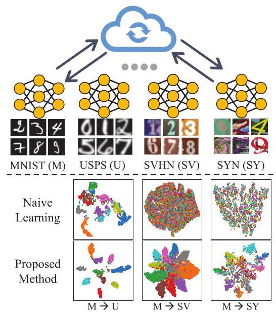
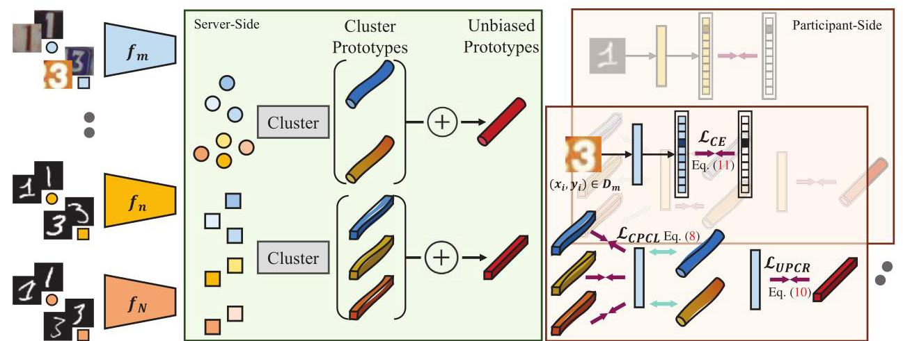
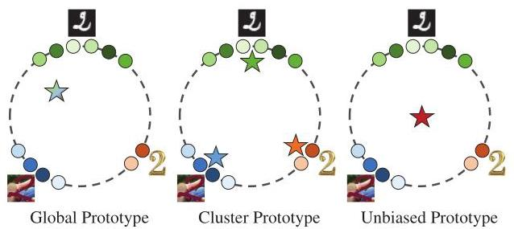
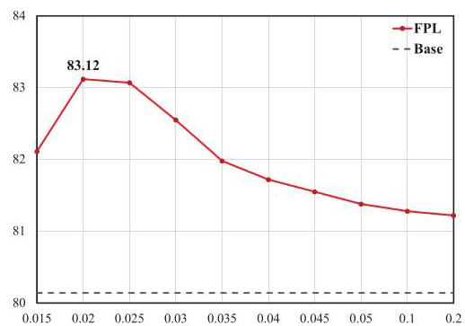
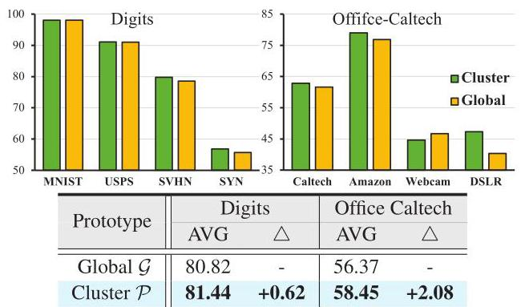
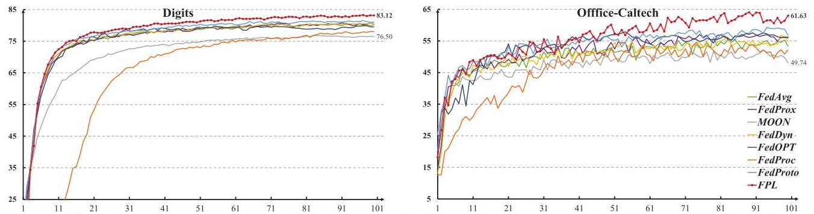
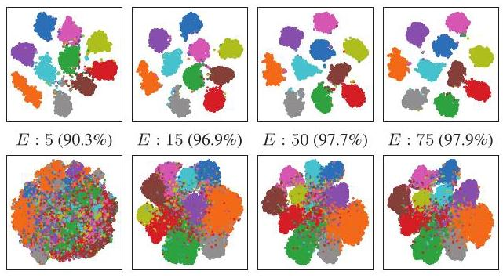

# Rethinking Federated Learning with Domain Shift: A Prototype View

# 从原型视角重新思考域转移下的联邦学习

Wenke Huang ${}^{1}$ , Mang Ye ${}^{1,2 * }$ , Zekun Shi ${}^{1}$ , He Li ${}^{1}$ , Bo Du ${}^{1,2 * }$

黄文柯 ${}^{1}$ ，叶芒 ${}^{1,2 * }$ ，石泽坤 ${}^{1}$ ，李赫 ${}^{1}$ ，杜博 ${}^{1,2 * }$

${}^{1}$ National Engineering Research Center for Multimedia Software, Institute of Artificial Intelligence,

${}^{1}$ 多媒体软件国家工程研究中心，人工智能研究所，

Hubei Key Laboratory of Multimedia and Network Communication Engineering,

多媒体与网络通信工程湖北省重点实验室，

School of Computer Science, Wuhan University, Wuhan, China.

武汉大学计算机科学学院，中国武汉。

${}^{2}$ Hubei Luojia Laboratory, Wuhan, China.

${}^{2}$ 湖北珞珈实验室，中国武汉。

https://github.com/WenkeHuang/RethinkFL

## Abstract

## 摘要

Federated learning shows a bright promise as a privacy-preserving collaborative learning technique. However, prevalent solutions mainly focus on all private data sampled from the same domain. An important challenge is that when distributed data are derived from diverse domains. The private model presents degenerative performance on other domains (with domain shift). Therefore, we expect that the global model optimized after the federated learning process stably provides generalizability performance on multiple domains. In this paper, we propose Federated Prototypes Learning (FPL) for federated learning under domain shift. The core idea is to construct cluster prototypes and unbiased prototypes, providing fruitful domain knowledge and a fair convergent target. On the one hand, we pull the sample embedding closer to cluster prototypes belonging to the same semantics than cluster prototypes from distinct classes. On the other hand, we introduce consistency regularization to align the local instance with the respective unbiased prototype. Empirical results on Digits and Office Caltech tasks demonstrate the effectiveness of the proposed solution and the efficiency of crucial modules.

联邦学习作为一种隐私保护的协作学习技术，展现出光明的前景。然而，目前流行的解决方案主要集中在从同一域中采样的所有私有数据上。一个重要的挑战是，当分布式数据来自不同域时，私有模型在其他域(存在域转移)上会表现出退化的性能。因此，我们期望在联邦学习过程后优化的全局模型能够在多个域上稳定地提供泛化性能。在本文中，我们提出了用于域转移下联邦学习的联邦原型学习(Federated Prototypes Learning，FPL)。其核心思想是构建聚类原型和无偏原型，提供丰富的域知识和公平的收敛目标。一方面，我们将样本嵌入拉得更接近属于相同语义的聚类原型，而不是来自不同类别的聚类原型。另一方面，我们引入一致性正则化，使局部实例与各自的无偏原型对齐。在数字和加州理工学院办公室任务上的实证结果证明了所提解决方案的有效性以及关键模块的效率。

## 1. Introduction

## 1. 引言

Federated learning is a privacy-preserving paradigm [47, 83], which reaches collaborative learning without leaking privacy. The cornerstone solution, FedAvg [47], aggregates parameters from participants and then distributes the global model (averaged parameters) back for further training, which aims to learn a high-quality model without centralizing private data. However, an inherent challenge in federated learning is data heterogeneity $\left\lbrack  {{26},{39},{69},{87}}\right\rbrack$ . Specifically, the private data is collected from distinct sources with diverse preferences and presents non-iid (independently and identically distributed) distribution [87]. Each participant optimizes toward the local empirical risk minimum, which is inconsistent with the global direction. Therefore, the averaged global model unavoidably faces a slow convergence speed [40] and achieves limited performance improvement.

联邦学习是一种隐私保护范式[47, 83]，它能够在不泄露隐私的情况下实现协作学习。其基石性解决方案FedAvg[47]，聚合参与者的参数，然后将全局模型(平均参数)分发回去进行进一步训练，旨在在不集中私有数据的情况下学习高质量模型。然而，联邦学习中的一个固有挑战是数据异构性 $\left\lbrack  {{26},{39},{69},{87}}\right\rbrack$ 。具体而言，私有数据是从具有不同偏好的不同来源收集的，呈现出非独立同分布(non-iid)[87]。每个参与者朝着局部经验风险最小化进行优化，这与全局方向不一致。因此，平均后的全局模型不可避免地面临收敛速度慢[40]的问题，并且性能提升有限。

Figure 1. Illustration of heterogeneous federated learning. The feature visualization on inter domains ( $\rightarrow$ represents testing on target domain i.e., $\mathrm{M} \rightarrow  \mathrm{{SV}}$ means that local dataset is from MNIST and test model on SVHN). The top row indicates that local training results in domain shift. The bottom row shows that our method acquires generalizable performance on different domains.

图1. 异构联邦学习示意图。跨域的特征可视化( $\rightarrow$ 表示在目标域上进行测试，即 $\mathrm{M} \rightarrow  \mathrm{{SV}}$ 表示局部数据集来自MNIST并在SVHN上测试模型)。上图表明局部训练会导致域转移。下图显示我们的方法在不同域上获得了泛化性能。

A mainstream of subsequent efforts delves into introducing a variety of global signals to regulate private model $\left\lbrack  {{13},{28},{38},{40},{51},{66},{70}}\right\rbrack$ . These methods focus on label skew, where distributed data are from the same domain, and simulate data heterogeneity via imbalanced sampling, e.g., Dirichlet strategy [32] to generate different label distributions. Nonetheless, another noticeable data heterogeneous property in federated learning is domain shift $\left\lbrack  {{21},{22},{41},{55},{57}}\right\rbrack$ . In particular, private data is derived from various domains, leading to distinct feature distributions. In this scenario, we argue that naive learning on private data brings poor generalizable ability in Fig. 1. Specifically, the private model fails to provide discrimination on other domains because it overfits local domain distribution. The aforementioned methods mainly regulate the private model via global knowledge (i.e., the average signals from participants). Therefore, these algorithms share a common weakness: the global information is insufficient to describe diverse domain knowledge, which is magnified under the domain shift and thus hinders the improvement of generalizability. An intuitive solution is to preserve multiple models for distilling respective domain knowledge. However, it incurs a high cost of both communication and computation.

后续工作的一个主流方向是深入研究引入各种全局信号来调节私有模型 $\left\lbrack  {{13},{28},{38},{40},{51},{66},{70}}\right\rbrack$ 。这些方法关注标签偏斜，即分布式数据来自同一域，并通过不平衡采样(例如狄利克雷策略[32])来模拟数据异构性，以生成不同的标签分布。然而，联邦学习中另一个值得注意的数据异构属性是域转移 $\left\lbrack  {{21},{22},{41},{55},{57}}\right\rbrack$ 。特别是，私有数据来自不同的域，导致不同的特征分布。在这种情况下，我们认为对私有数据进行简单学习会导致如图1所示的泛化能力较差。具体而言，私有模型无法在其他域上提供区分能力，因为它过度拟合了局部域分布。上述方法主要通过全局知识(即来自参与者的平均信号)来调节私有模型。因此，这些算法存在一个共同的弱点:全局信息不足以描述多样的域知识，在域转移的情况下，这一问题会被放大，从而阻碍了泛化能力的提升。一个直观的解决方案是保留多个模型来提炼各自的域知识。然而，这会带来高昂的通信和计算成本。

---

*Corresponding Author: Mang Ye, Bo Du

*通讯作者:叶芒，杜博

---

Taking into account both the effectiveness and efficiency, we rethink the prototype $\left\lbrack  {{11},{36},{67},{82},{91}}\right\rbrack$ , which is the mean value of features with identical semantics. It represents class-wise characteristics and is vector type [90]. Given the enormous participant scale in federated learning, it is not efficient and feasible to maintain all prototypes. However, directly averaging all prototypes to get global prototypes would arise the same impediment as global models because averaging operation weakens the domain diversity. Besides, global prototypes probably yield biased to the dominant domain due to the unknown of private domains proportion, which results in disadvantageous performance on minority domains. Driven by these two issues, on the one hand, we find representative prototypes by clustering all prototypes. Therefore, each class is abstracted by a set of diverse prototypes, capturing rich domain variance. On the other hand, we generate unbiased prototypes based on cluster prototypes to construct fair and stable global signals, which avoid optimizing toward the underlying primary domain and thus ensure stability on different domains. Compared with original feature vectors, cluster and unbiased prototypes are privacy-friendly because it experiences twice and third times averaging operation [70]. Hence, it is less feasible to disentangle each raw representation and subsequently reconstruct private data. We analyze the superiority of cluster prototypes and unbiased prototypes in Sec. 3.2.

综合考虑有效性和效率，我们重新思考了原型 $\left\lbrack  {{11},{36},{67},{82},{91}}\right\rbrack$，它是具有相同语义的特征的均值。它代表了类别的特征，并且是向量类型[90]。考虑到联邦学习中巨大的参与者规模，维护所有原型既低效又不可行。然而，直接对所有原型进行平均以获得全局原型会出现与全局模型相同的障碍，因为平均操作会削弱域的多样性。此外，由于私有域比例未知，全局原型可能会偏向于主导域，这会导致在少数域上的性能不佳。受这两个问题的驱动，一方面，我们通过对所有原型进行聚类来找到有代表性的原型。因此，每个类由一组不同的原型抽象而成，捕捉了丰富的域差异。另一方面，我们基于聚类原型生成无偏原型，以构建公平且稳定的全局信号，这避免了朝着潜在的主要域进行优化，从而确保在不同域上的稳定性。与原始特征向量相比，聚类和无偏原型对隐私更友好，因为它们经过了两次和三次平均操作[70]。因此，解开每个原始表示并随后重建私有数据的可行性较低。我们在3.2节中分析了聚类原型和无偏原型的优势。

In this paper, we propose Federated Prototype Learning (FPL), which consists of two components. First, in order to improve the generalizability on the premise of discriminability. We introduce Cluster Prototypes Contrastive Learning (CPCL), which leverages cluster prototypes to construct contrastive learning [7, 19,79,84,85]. CPCL adaptively enforces the query embedding to be more similar to cluster prototypes from the same class than other prototypes with different semantics. In particular, such an objective encourages instance feature to be close to representative prototypes in the same semantic and separates it away from other class prototypes, which incorporates diverse domain knowledge and maintains a clear decision boundary. Second, we utilize unbiased prototypes to provide a fair and stable convergence point and propose Unbiased Prototypes Consistent Regularization (UPCR). Specifically, we average cluster prototypes to acquire unbiased prototypes. The local instance is required to minimize the feature-level distance with the corresponding unbiased prototype. Therefore, the local model would not be biased toward dominant domains and exhibits stable performance on inferior domains. We conjecture that these two components together make FPL a competitive method for federated learning with domain shift. The main contributions are summarized below.

在本文中，我们提出了联邦原型学习(Federated Prototype Learning，FPL)，它由两个部分组成。首先，为了在可区分性的前提下提高泛化能力。我们引入了聚类原型对比学习(Cluster Prototypes Contrastive Learning，CPCL)，它利用聚类原型来构建对比学习[7, 19, 79, 84, 85]。CPCL自适应地强制查询嵌入与来自同一类的聚类原型比与具有不同语义的其他原型更相似。具体而言，这样的目标鼓励实例特征在相同语义下接近代表性原型，并将其与其他类原型分开，这融合了多样的域知识并保持了清晰的决策边界。其次，我们利用无偏原型来提供一个公平且稳定的收敛点，并提出了无偏原型一致性正则化(Unbiased Prototypes Consistent Regularization，UPCR)。具体来说，我们对聚类原型进行平均以获得无偏原型。要求局部实例最小化与相应无偏原型的特征级距离。因此，局部模型不会偏向于主导域，并且在次优域上表现出稳定的性能。我们推测这两个部分共同使FPL成为一种在具有域转移的联邦学习中具有竞争力的方法。主要贡献总结如下。

- We focus on heterogeneous federated learning with domain shift and identify that the inherent limitation of existing methods is that global regularization signal is insufficient to depict diverse domain knowledge and biased toward major domain among participants.

- 我们关注具有域转移的异构联邦学习，并确定现有方法的固有局限性在于全局正则化信号不足以描绘多样的域知识，并且在参与者中偏向于主要域。

- We propose a simple yet effective strategy to learn a well generalizable global model in federated learning with domain shift. Inspired by the success of prototype learning, we introduce cluster prototypes to provide rich domain knowledge and further construct unbiased prototypes based on the average of cluster prototypes to further offer fair and stable objective signal.

- 我们提出了一种简单而有效的策略，用于在具有域转移的联邦学习中学习一个具有良好泛化能力的全局模型。受原型学习成功的启发，我们引入聚类原型以提供丰富的域知识，并基于聚类原型的平均值进一步构建无偏原型，以进一步提供公平且稳定的目标信号。

- We conduct extensive experiments on Digits [23, 33, 52, 61] and Office Caltech [16] tasks. Accompanied with a set of ablative studies, promising results validate the efficacy of FPL and the indispensability of each module.

- 我们在数字[23, 33, 52, 61]和办公加州理工[16]任务上进行了广泛的实验。伴随着一系列的消融研究，有前景的结果验证了FPL的有效性以及每个模块的不可或缺性。

## 2. Related Work

## 2. 相关工作

### 2.1. Data Heterogeneous Federated Learning

### 2.1. 数据异构联邦学习

Federated learning is proposed to handle privacy concerns in the distributed learning environment. A pioneering federated method, FedAvg [47] trains a global model by aggregating local model parameters. However, its performance is impeded due to decentralized data, which poses non-i.i.d distribution (called data heterogeneity). Based on FedAvg, existing methods of tackling data heterogeneity problem mainly leverage global penalty term. Fed-Prox [40], FedCurv [66], pFedME [68], and FedDyn [1] calculate global parameter stiffness to control discrepancies. Besides, MOON [38], FedUFO [86], FedProto [70], and FedProc [51] maximize feature-level agreement of local model and global model. Moreover, SCAFFOLD [28] and FedDC [13] leverage global gradient calibration to control local drift. The major limitation of these methods is that they focus on single domain performance under label skew scenario and overlook the problem of domain shift, leading to an unsatisfying generalizable performance on multiple domains. Closely related methods such as FedBN [41], ADCOL [37], FCCL [22] focus on personalized models rather than a shared global model. Besides, the latter two methods require additional discriminator and public data, which incurs a heavy burden for either the participant or the server side. In this paper, we introduce cluster prototypes (diverse domain knowledge) and unbiased prototypes (consistent optimization direction) to learn a generalizable and stable global model during the federated learning process.

联邦学习旨在解决分布式学习环境中的隐私问题。一种开创性的联邦方法，FedAvg [47] 通过聚合局部模型参数来训练全局模型。然而，由于数据分散，其性能受到阻碍，这导致了非独立同分布(称为数据异构性)。基于FedAvg，现有的解决数据异构性问题的方法主要利用全局惩罚项。Fed-Prox [40]、FedCurv [66]、pFedME [68] 和 FedDyn [1] 计算全局参数刚度以控制差异。此外，MOON [38]、FedUFO [86]、FedProto [70] 和 FedProc [51] 最大化局部模型和全局模型的特征级一致性。此外，SCAFFOLD [28] 和 FedDC [13] 利用全局梯度校准来控制局部漂移。这些方法的主要局限性在于它们关注标签倾斜场景下的单域性能，而忽略了域转移问题，导致在多个域上的泛化性能不尽人意。密切相关的方法，如FedBN [41]、ADCOL [37]、FCCL [22] 关注个性化模型而非共享全局模型。此外，后两种方法需要额外的鉴别器和公共数据，这给参与者或服务器端带来了沉重负担。在本文中，我们引入聚类原型(多样的域知识)和无偏原型(一致的优化方向)，以便在联邦学习过程中学习一个可泛化且稳定的全局模型。

### 2.2. Clustering Federated Learning

### 2.2. 聚类联邦学习

Clustered federated learning involves grouping clients with similar data distributions into clusters, such that each client is uniquely associated with a particular data distribution and contributes to the training of a model tailored to that distribution $\left\lbrack  {{64},{80}}\right\rbrack$ . Existing methods can mainly leverage four types of clustering signals: model parameters $\left\lbrack  {5,{43}}\right\rbrack$ , gradient information $\left\lbrack  {{10},{64}}\right\rbrack$ , training loss $\left\lbrack  {{15},{46}}\right\rbrack$ and exogenous information [2,42]. However, we leverage the clustering strategy to select representative prototypes in order to address the federated learning with domain shift.

聚类联邦学习涉及将具有相似数据分布的客户端分组为集群，使得每个客户端与特定的数据分布唯一相关联，并有助于训练针对该分布量身定制的模型 $\left\lbrack  {{64},{80}}\right\rbrack$ 。现有方法主要可以利用四种类型的聚类信号:模型参数 $\left\lbrack  {5,{43}}\right\rbrack$ 、梯度信息 $\left\lbrack  {{10},{64}}\right\rbrack$ 、训练损失 $\left\lbrack  {{15},{46}}\right\rbrack$ 和外部信息 [2,42]。然而，我们利用聚类策略来选择有代表性的原型，以解决存在域转移的联邦学习问题。

### 2.3. Prototype Learning

### 2.3. 原型学习

Prototype refers to the mean vector of the instances belonging to the identical class [67]. Due to its exemplar-driven nature and simpler inductive bias, it has boosted great potential in a variety of tasks. For example, in supervised classification tasks, it labels testing images via calculating its distance with prototypes of each class, which is considered to be more robust and stabler [81] in handling few-shot [48, 67, 75, 81], zero-shot [25]. Moreover, it also has been a surge of interest in semantic segmentation task $\left\lbrack  {{35},{77},{90}}\right\rbrack$ , unsupervised learning $\left\lbrack  {{18},{36},{79},{84},{85}}\right\rbrack$ and so on. As for federated learning, prototypes can provide diverse abstract knowledge while adhering to privacy protocols. There exist a few works incorporating prototypes to handle data heterogeneous federated learning. PGFL [49] leverages prototypes to construct weight attention parameter aggregation. FedProc [51] and FedProto [70] aim to reach feature-wise alignment with global prototypes. CCVR [44] generates virtual feature based on approximated Gaussian Mixture Model. FedPCL [71] focuses on personalized federated learning and utilizes prototypes to learn personalized models. However, these methods focus on single-domain performance. In domain shift, it is vital to consider generalization on diverse domains. Our work sheds light on leveraging cluster and unbiased prototypes to achieve this goal in federated learning.

原型是指属于同一类别的实例的均值向量 [67]。由于其示例驱动的性质和更简单的归纳偏差，它在各种任务中具有巨大潜力。例如，在监督分类任务中，它通过计算与每个类别的原型的距离来标记测试图像，这在处理少样本 [48, 67, 75, 81]、零样本 [25] 时被认为更稳健、更稳定 [81]。此外，它在语义分割任务 $\left\lbrack  {{35},{77},{90}}\right\rbrack$ 、无监督学习 $\left\lbrack  {{18},{36},{79},{84},{85}}\right\rbrack$ 等方面也引起了人们的浓厚兴趣。至于联邦学习，原型可以在遵守隐私协议的同时提供多样化的抽象知识。有一些工作将原型纳入以处理数据异构的联邦学习。PGFL [49] 利用原型来构建权重注意力参数聚合。FedProc [51] 和 FedProto [70] 的目标是与全局原型达成特征对齐。CCVR [44] 基于近似高斯混合模型生成虚拟特征。FedPCL [71] 专注于个性化联邦学习，并利用原型来学习个性化模型。然而，这些方法都侧重于单域性能。在域转移中，考虑在不同域上的泛化能力至关重要。我们的工作阐明了如何利用聚类和无偏原型在联邦学习中实现这一目标。

### 2.4. Contrastive Learning

### 2.4. 对比学习

Contrastive learning has recently become a promising direction in the self-supervised learning field, achieving competitive performance as supervised learning. The classic methods $\left\lbrack  {7,{19},{53},{79},{84},{85}}\right\rbrack$ mainly construct a positive pair and a negative pair for each instance and leverage InfoNCE [54] to contrast positiveness against negativeness. A major branch of subsequent research focuses on elaborating the selection of the informative positive pairs $\left\lbrack  {3,{12},{30},{31},{34},{56},{59},{65}}\right\rbrack$ and negative pairs $\left\lbrack  {8,{14},{24},{27},{50},{60},{72},{88}}\right\rbrack$ . Another line explicitly investigates the semantic structure and introduces unsupervised clustering methods to construct fruitful prototypes as representative embeddings for groups of semantically similar instances $\left\lbrack  {6,{18},{36},{73},{89}}\right\rbrack$ . Differently, in this work, Cluster Prototypes Contrastive Learning (CPCL) is designed for providing generalization ability in federated learning with domain shift. We leverage the unsupervised clustering algorithm to select representative prototypes for each class and then seek to attract each instance to cluster prototypes in the same semantics while pushing away other cluster prototypes from different classes, which brings both generalizable and discriminative ability.

对比学习最近已成为自监督学习领域中一个很有前景的方向，取得了与监督学习相媲美的性能。经典方法 $\left\lbrack  {7,{19},{53},{79},{84},{85}}\right\rbrack$ 主要为每个实例构建一个正样本对和一个负样本对，并利用InfoNCE [54] 来对比正样本与负样本。后续研究的一个主要分支专注于详细阐述信息丰富的正样本对 $\left\lbrack  {3,{12},{30},{31},{34},{56},{59},{65}}\right\rbrack$ 和负样本对 $\left\lbrack  {8,{14},{24},{27},{50},{60},{72},{88}}\right\rbrack$ 的选择。另一条线明确研究语义结构，并引入无监督聚类方法来构建丰富的原型，作为语义相似实例组的代表性嵌入 $\left\lbrack  {6,{18},{36},{73},{89}}\right\rbrack$ 。不同的是，在这项工作中，聚类原型对比学习(CPCL)旨在为存在域转移的联邦学习提供泛化能力。我们利用无监督聚类算法为每个类选择有代表性的原型，然后试图将每个实例吸引到具有相同语义的聚类原型中，同时将来自不同类的其他聚类原型推开，这带来了泛化能力和判别能力。

## 3. Methodology

## 3. 方法

### 3.1. Preliminaries

### 3.1. 预备知识

Following the typical federated learning [40, 47], there are $M$ participants (indexed by $m$ ) with respective private data, ${D}_{m} = {\left\{  {x}_{i},{y}_{i}\right\}  }_{i = 1}^{{N}_{m}}$ , where ${N}_{m}$ denotes the local data scale. Under heterogeneous federated learning, the conditional feature distribution $P\left( {x \mid  y}\right)$ varies across participants even if $P\left( y\right)$ is consistent, resulting in domain shift:

遵循典型的联邦学习 [40, 47]，有 $M$ 个参与者(由 $m$ 索引)，每个参与者都有各自的私有数据 ${D}_{m} = {\left\{  {x}_{i},{y}_{i}\right\}  }_{i = 1}^{{N}_{m}}$ ，其中 ${N}_{m}$ 表示本地数据规模。在异构联邦学习中，即使 $P\left( y\right)$ 是一致的，条件特征分布 $P\left( {x \mid  y}\right)$ 在参与者之间也会有所不同，从而导致域转移:

- Domain shift: ${P}_{m}\left( {x \mid  y}\right)  \neq  {P}_{n}\left( {x \mid  y}\right) \left( {{P}_{m}\left( y\right)  = }\right.$ ${P}_{n}\left( y\right)$ ). There exists domain shift among private data. Specifically, for the same label space, distinctive feature distribution exists among different participants.

- 域转移:${P}_{m}\left( {x \mid  y}\right)  \neq  {P}_{n}\left( {x \mid  y}\right) \left( {{P}_{m}\left( y\right)  = }\right.$ ${P}_{n}\left( y\right)$ )。私有数据之间存在域转移。具体而言，对于相同的标签空间，不同参与者之间存在独特的特征分布。

Besides, participants agree on sharing a model with the same architecture. We regard the model with two modules: feature extractor and unified classifier. The feature extractor $f : \mathcal{X} \rightarrow  \mathcal{Z}$ , encodes sample $x$ into a compact $d$ dimensional feature vector $z = f\left( x\right)  \in  {\mathbb{R}}^{d}$ in the feature space $\mathcal{Z}$ . A unified classifier $g : \mathcal{Z} \rightarrow  {\mathbb{R}}^{\left| I\right| }$ , maps feature $z$ into logits output $l = g\left( z\right)$ , where $I$ means the classification categories. The optimization direction is to learn a generalizable global model to present favorable performance on multiple domains, through the federated learning process.

此外，参与者同意共享具有相同架构的模型。我们将该模型视为由两个模块组成:特征提取器和统一分类器。特征提取器 $f : \mathcal{X} \rightarrow  \mathcal{Z}$ ，将样本 $x$ 编码为特征空间 $\mathcal{Z}$ 中一个紧凑的 $d$ 维特征向量 $z = f\left( x\right)  \in  {\mathbb{R}}^{d}$ 。统一分类器 $g : \mathcal{Z} \rightarrow  {\mathbb{R}}^{\left| I\right| }$ ，将特征 $z$ 映射为对数几率输出 $l = g\left( z\right)$ ，其中 $I$ 表示分类类别。优化方向是通过联邦学习过程学习一个可泛化的全局模型，以在多个域上呈现良好的性能。

### 3.2. Prototypes Meet Federated Learning

### 3.2. 原型与联邦学习相遇

Motivation. Each prototype ${c}^{k} \in  {R}^{d}$ is calculated by the mean vector of the features belonging to same class:

动机。每个原型 ${c}^{k} \in  {R}^{d}$ 由属于同一类别的特征的均值向量计算得出:

$$
{c}^{k} = \frac{1}{\left| {S}^{k}\right| }\mathop{\sum }\limits_{{\left( {{x}_{i},{y}_{i}}\right)  \in  {S}^{k}}}f\left( {x}_{i}\right) , \tag{1}
$$

where ${S}^{k}$ means the set of samples annotated with class $k$ . Prototypes are typical for respective semantic information. Besides, it carries the specific domain style information because the prototypes are not consistent on different domains. Therefore, it motivates us to leverage prototypes from different domains to learn a generalizable model without leaking privacy information. We further define the ${k}^{th}$

其中 ${S}^{k}$ 表示用类别 $k$ 标注的样本集。原型对于各自的语义信息具有代表性。此外，它携带特定的域风格信息，因为原型在不同域上不一致。因此，这促使我们利用来自不同域的原型来学习一个可泛化的模型，同时不泄露隐私信息。我们进一步定义 ${k}^{th}$

Figure 2. Architecture illustration of Federated Prototypes Learning (FPL). Participants upload local prototypes to server. Based on these prototypes, we introduce cluster prototypes ( CR ) to construct Cluster Prototypes Contrastive Learning (CPCL in Sec. 3.3.1), bringing diverse domain information. Besides, we acquire unbiased prototypes ( CI ) and propose Unbiased Prototypes Consistent Regularization (UPCR in Sec. 3.3.2) to provide a stable consistency signal. Best viewed in color. Zoom in for details.

图2. 联邦原型学习(FPL)的架构示意图。参与者将本地原型上传到服务器。基于这些原型，我们引入聚类原型(CR)以构建聚类原型对比学习(第3.3.1节中的CPCL)，引入多样的域信息。此外，我们获取无偏原型(CI)并提出无偏原型一致性正则化(第3.3.2节中的UPCR)以提供稳定的一致性信号。最佳以彩色查看。放大查看细节。

class prototype from the ${m}^{th}$ participant as:

来自 ${m}^{th}$ 参与者的类别原型定义为:

$$
{c}_{m}^{k} = \frac{1}{\left| {S}_{m}^{k}\right| }\mathop{\sum }\limits_{{\left( {{x}_{i},{y}_{i}}\right)  \in  {S}_{m}^{k}}}{f}_{m}\left( {x}_{i}\right)  \tag{2}
$$

$$
{\mathcal{O}}_{m} = \left\lbrack  {{c}_{m}^{1},\ldots ,{c}_{m}^{k},\ldots ,{c}_{m}^{\left| I\right| }}\right\rbrack   \in  {\mathbb{R}}^{\left| I\right|  \times  d},
$$

where ${S}_{m}^{k} = {\left\{  {x}_{i},{y}_{i} \mid  {y}_{i} = k\right\}  }_{i = 1}^{{N}_{m}^{k}} \subset  {D}_{m}$ represents the private dataset ${D}_{m}$ of the ${k}^{th}$ class for the ${m}^{th}$ participant.

其中 ${S}_{m}^{k} = {\left\{  {x}_{i},{y}_{i} \mid  {y}_{i} = k\right\}  }_{i = 1}^{{N}_{m}^{k}} \subset  {D}_{m}$ 表示第 ${m}^{th}$ 个参与者的第 ${k}^{th}$ 类的私有数据集 ${D}_{m}$ 。

Global Prototypes. Considering that number of participants is large-scale in federated learning, the straightforward solution to leverage prototypes is the global prototypes(G)via directly averaging operation akin to the global model. Hence, the global prototypes are formulated into:

全局原型。考虑到在联邦学习中参与者数量众多，利用原型的直接解决方案是通过类似于全局模型的直接平均操作得到全局原型(G)。因此，全局原型定义为:

$$
{\mathcal{G}}^{k} = \frac{1}{N}\mathop{\sum }\limits_{{m = 1}}^{N}{c}_{m}^{k} \in  {\mathbb{R}}^{d} \tag{3}
$$

$$
\mathcal{G} = \left\lbrack  {{\mathcal{G}}^{1},\ldots ,{\mathcal{G}}^{k},\ldots ,{\mathcal{G}}^{\left| I\right| }}\right\rbrack  .
$$

However, global prototypes mainly suffer from two notable problems. O Global prototype unavoidably faces the same dilemma as the global model. In detail, it depicts each class signal by only one prototype, bearing no domain variation under heterogeneous federated learning with domain shift. 2 Moreover, due to the unknown of participants data distribution in federated learning, global prototypes would be biased toward the dominant domain distribution, leading to a skewed optimization objective during federated process.

然而，全局原型主要存在两个显著问题。其一，全局原型不可避免地面临与全局模型相同的困境。具体而言，它仅用一个原型来描绘每个类别的信号，在存在域转移的异构联邦学习下没有域变化。其二，由于在联邦学习中参与者数据分布未知，全局原型会偏向于主导域分布，导致在联邦过程中优化目标出现偏差。

Cluster Prototypes. Inspired by such limitations, we first propose cluster prototypes. Compared with global prototypes, we select representative prototypes rather than single one via unsupervised clustering method, FINCH [63]. Compared with well-known clustering techniques such as Kmeans [4, 45] and HAC [78], FINCH is parameter-free and thus suitable for federated learning with uncertain participants scale. Specifically, FINCH views that the nearest neighbor of each sample is a sufficient support for grouping.

聚类原型。受这些限制的启发，我们首先提出聚类原型。与全局原型相比，我们通过无监督聚类方法FINCH [63]选择有代表性的原型而非单个原型。与诸如Kmeans [4, 45]和HAC [78]等知名聚类技术相比，FINCH无参数，因此适用于参与者规模不确定的联邦学习。具体而言，FINCH认为每个样本的最近邻是分组的充分支持。

It implicitly picks characteristic prototypes because prototypes from different domains are less likely to be the first neighbor. Therefore, prototypes from different domains probably fail to merge together, while prototypes from similar domains fall into the same group, conversely. Specifically, we leverage cosine similarity to evaluate the distance between any two prototypes and view the prototype with minimum distance as its 'neighbor', sorted into the same set. We define the ${k}^{th}$ class prototype adjacency matrix as:

它隐含地挑选特征原型，因为来自不同域的原型不太可能是第一个邻居。因此，来自不同域的原型可能无法合并在一起，相反，来自相似域的原型会落入同一组。具体而言，我们利用余弦相似度来评估任意两个原型之间的距离，并将距离最小的原型视为其“邻居”，归入同一集合。我们将 ${k}^{th}$ 类原型邻接矩阵定义为:

$$
{A}^{k}\left( {m, n}\right)  = \left\{  \begin{array}{ll} 1, & \text{ if }n = {v}_{m}^{k}\text{ or }m = {v}_{n}^{k}\text{ or }{v}_{m}^{k} = {v}_{n}^{k}; \\  0, & \text{ otherwise,} \end{array}\right.  \tag{4}
$$

where ${v}_{m}^{k}$ denotes the first neighbor (largest cosine similarity) of the class $k$ prototype from the ${m}^{th}$ participant, ${c}_{m}^{k}$ . Then, we select several representative prototypes in the embedding space based on the clustering results via Eq. (4). Thus, the cluster prototypes(P)are denoted as:

其中，${v}_{m}^{k}$表示来自${m}^{th}$参与者的类别$k$原型的第一个邻居(最大余弦相似度)，${c}_{m}^{k}$。然后，我们根据聚类结果通过公式(4)在嵌入空间中选择几个有代表性的原型。因此，聚类原型(P)表示为:

$$
{\mathcal{P}}^{k} = {\left\{  {c}_{m}^{k}\right\}  }_{m = 1}^{N}\text{Cluster}{\left\{  {c}_{m}^{k}\right\}  }_{m = 1}^{J} \in  {\mathbb{R}}^{J \times  d} \tag{5}
$$

$$
\mathcal{P} = \left\{  {{\mathcal{P}}^{1},\ldots ,{\mathcal{P}}^{k},\ldots ,{\mathcal{P}}^{\left| I\right| }}\right\}  .
$$

We cluster $N$ prototypes into $J$ representatives of class $k$ , which effectively addresses the aforementioned problem0.

我们将$N$个原型聚类为$k$类的$J$个代表，这有效地解决了上述问题0。

Unbiased Prototypes. Nevertheless, the scale of cluster prototypes is variant because the unsupervised clustering methods generate them after each communication, which can not ensure a stable and fair convergent point. Thus, we further average cluster prototypes to get a consistent signal: unbiased prototypes(U), which is calculated as follows:

无偏原型。然而，聚类原型的规模是可变的，因为无监督聚类方法在每次通信后生成它们，这不能确保一个稳定和公平的收敛点。因此，我们进一步对聚类原型求平均以获得一个一致的信号:无偏原型(U)，其计算如下:

$$
{\mathcal{U}}^{k} = \frac{1}{J}\mathop{\sum }\limits_{{{c}^{k} \in  {\mathcal{P}}^{k}}}{c}^{k} \in  {\mathbb{R}}^{d} \tag{6}
$$

$$
\mathcal{U} = \left\lbrack  {{\mathcal{U}}^{1},\ldots ,{\mathcal{U}}^{k},\ldots ,{\mathcal{U}}^{\left| I\right| }}\right\rbrack  .
$$

Note that compared with global prototypes(G), unbiased prototypes(U)largely avoid being biased toward dominant domains in heterogeneous federated learning and provide a stable optimization target. Thus, we hypothesize that unbiased prototypes could depict the considerably fair convergent point and further leverage them to conduct consistent regularization, which productively handles the problem 2.

请注意，与全局原型(G)相比，无偏原型(U)在很大程度上避免了在异构联邦学习中偏向于主导域，并提供了一个稳定的优化目标。因此,我们假设无偏原型可以描绘出相当公平的收敛点，并进一步利用它们进行一致的正则化，这有效地处理了问题2。

Figure 3. Illustration of different prototypes. Global prototype (★) fails to describe diverse domains information and is biased toward the underlying dominant domain. Cluster prototype (★ ★ A) and unbiased prototype ( $\star$ ) carry multiple domain knowledge and stable optimization signal. See details in Sec. 3.2.

图3.不同原型的示意图。全局原型(★)无法描述不同域的信息，并且偏向于潜在的主导域。聚类原型(★★A)和无偏原型($\star$)携带多个域知识和稳定的优化信号。详见3.2节。

Discussion. We further explain the difference of these three kinds of prototypes in Fig. 3. Global prototypes inherently present limited domain knowledge and show skewed feature space toward the potentially dominant domains in heterogeneous federated learning. Cluster and unbiased prototypes complementarily handle these two problems because the former provides fruitful domain knowledge and the latter represents an ideal optimization target, collaboratively ensuring both generalization and stability. Compared with existing methods that leverage the global model to construct regularization term, prototypes are substantially smaller in size than model parameters, which bring less computation cost for participants. Besides, cluster prototypes and unbiased prototypes are privacy-safe because they experience twice and third times averaging operations through unsupervised clustering. Therefore, leveraging these two kinds of prototypes: cluster prototypes and unbiased prototypes is not only a computation-friendly media but also a privacy-preserving solution in heterogeneous federated learning.

讨论。我们在图3中进一步解释了这三种原型的差异。全局原型本质上呈现出有限的域知识，并且在异构联邦学习中显示出向潜在主导域倾斜的特征空间。聚类原型和无偏原型互补地处理这两个问题，因为前者提供了丰富的域知识，而后者代表了一个理想的优化目标，共同确保了泛化性和稳定性。与利用全局模型构建正则化项的现有方法相比，原型的大小比模型参数小得多，这为参与者带来了更少的计算成本。此外，聚类原型和无偏原型是隐私安全的，因为它们通过无监督聚类经历了两次和三次平均操作。因此，利用这两种原型:聚类原型和无偏原型不仅是一种计算友好的媒介，而且是异构联邦学习中的一种隐私保护解决方案。

### 3.3. Federated Prototypes Learning

### 3.3. 联邦原型学习

For generalizability and stability in heterogeneous federated learning with domain shift, we leverage cluster prototypes and unbiased prototypes to obtain fruitful domain knowledge and stable consistency signal. The proposed method comprises two key components: Cluster Prototypes Contrastive Learning (CPCL in Sec. 3.3.1) and Unbiased Prototypes Consistent Regularization (UPCR in Sec. 3.3.2).

为了在具有域转移的异构联邦学习中实现泛化性和稳定性，我们利用聚类原型和无偏原型来获得丰富的域知识和稳定的一致性信号。所提出的方法包括两个关键组件:聚类原型对比学习(3.3.1节中的CPCL)和无偏原型一致正则化(3.3.2节中的UPCR)。

#### 3.3.1 Cluster Prototypes Contrastive Learning

#### 3.3.1聚类原型对比学习

We deem that a well-generalizable representation should not only be discriminative to provide a clear decisional boundary for different classes but also be as invariant as possible to diverse domain distortions that are applied to this sample. Specifically, for instance $\left( {{x}_{i},{y}_{i}}\right)  \in  {D}_{m}$ , we feed it into network and acquire its feature vector ${z}_{i} =$ $f\left( {x}_{i}\right)$ . Then, we enforce the instance feature to be similar to respective semantic prototypes $\left( {\mathcal{P}}^{k}\right)$ and dissimilar to different semantic prototypes $\left( {{\mathcal{N}}^{k} = \mathcal{P} - {\mathcal{P}}^{k}}\right)$ . We define the similarity of the query sample embedding ${z}_{i}$ with corresponding cluster prototypes $c \in  \mathcal{P}$ as follows:

我们认为，一个具有良好泛化性的表示不仅应该具有区分性，为不同类别提供清晰的决策边界，而且应该尽可能对应用于该样本的各种域失真保持不变。具体来说，例如$\left( {{x}_{i},{y}_{i}}\right)  \in  {D}_{m}$，我们将其输入网络并获得其特征向量${z}_{i} =$$f\left( {x}_{i}\right)$。然后，我们强制实例特征与各自的语义原型$\left( {\mathcal{P}}^{k}\right)$相似，与不同的语义原型$\left( {{\mathcal{N}}^{k} = \mathcal{P} - {\mathcal{P}}^{k}}\right)$不相似。我们将查询样本嵌入${z}_{i}$与相应聚类原型$c \in  \mathcal{P}$的相似度定义如下:

$$
s\left( {{z}_{i}, c}\right)  = \frac{{z}_{i} \cdot  c}{\begin{Vmatrix}{z}_{i}\end{Vmatrix} \times  \parallel c\parallel /\tau }, \tag{7}
$$

where temperature hyper-parameter, $\tau$ controls the concentration strength of representations [76]. Thus, we expect to enlarge the similarity with semantic coincident cluster prototypes than other different cluster prototypes, which aims to maintain a clear class-wise decision boundary. In our work, we introduce Cluster Prototypes Contrastive Learning (CPCL) to contrast cluster prototypes with the same class for each query sample against other remainder of cluster prototypes with different semantics. It is natural to derive the following optimization objective term:

其中，温度超参数$\tau$控制表示的集中强度[76]。因此，我们期望与语义一致的聚类原型的相似度比其他不同的聚类原型更大，这旨在保持清晰的类别决策边界。在我们的工作中，我们引入聚类原型对比学习(CPCL)，将每个查询样本的同一类别的聚类原型与具有不同语义的聚类原型的其他剩余部分进行对比。自然而然地得出以下优化目标项:

$$
{\mathcal{L}}_{CPCL} =  - \log \frac{\mathop{\sum }\limits_{{c \in  {\mathcal{P}}^{k}}}\exp \left( {s\left( {{z}_{i}, c}\right) }\right) }{\mathop{\sum }\limits_{{c \in  {\mathcal{P}}^{k}}}\exp \left( {s\left( {{z}_{i}, c}\right) }\right)  + \mathop{\sum }\limits_{{c \in  {\mathcal{N}}^{k}}}\exp \left( {s\left( {{z}_{i}, c}\right) }\right) }
$$

$$
= \log \left( {1 + \frac{\mathop{\sum }\limits_{{c \in  {\mathcal{N}}^{k}}}\exp \left( {s\left( {{z}_{i}, c}\right) }\right) }{\mathop{\sum }\limits_{{c \in  {\mathcal{P}}^{k}}}\exp \left( {s\left( {{z}_{i}, c}\right) }\right) }}\right) ,
$$

(8)

We give a detailed optimization direction analysis of Eq. (8) and thus reformulate the CPCL loss function as follows: $\min {\mathcal{L}}_{CPCL}$

我们对公式(8)进行了详细的优化方向分析，从而将CPCL损失函数重新表述如下:$\min {\mathcal{L}}_{CPCL}$

$$
\equiv  \log \left( \frac{\mathop{\sum }\limits_{{c \in  {\mathcal{N}}^{k}}}\exp \left( {s\left( {{z}_{i}, c}\right) }\right) }{\mathop{\sum }\limits_{{c \in  {\mathcal{P}}^{k}}}\exp \left( {s\left( {{z}_{i}, c}\right) }\right) }\right)
$$

$$
\equiv  \underset{\text{Discriminative }}{\underbrace{\log \left( {\mathop{\sum }\limits_{{c \in  {\mathcal{N}}^{k}}}\exp \left( {s\left( {{z}_{i}, c}\right) }\right) }\right) }} - \underset{\text{Generalizable }}{\underbrace{\log \left( {\mathop{\sum }\limits_{{c \in  {\mathcal{P}}^{k}}}\exp \left( {s\left( {{z}_{i}, c}\right) }\right) }\right) }}.
$$

(9)

Note that minimizing Eq. (8) equally requires pulling embedding vector ${z}_{i}$ closely to its assigned positive cluster prototypes $\left( {\mathcal{P}}^{k}\right)$ and pushing ${z}_{i}$ far away from others negative prototypes $\left( {\mathcal{N}}^{k}\right)$ , which not only aims to be invariant to diverse domain distortions but also enhances the semantic spread-out property, promising both generalizable and discriminative property of feature space and thus acquiring satisfying generalizable performance in federated learning.

请注意，最小化公式(8)同样需要将嵌入向量 ${z}_{i}$ 拉近到其分配的正聚类原型 $\left( {\mathcal{P}}^{k}\right)$ ，并将 ${z}_{i}$ 推离其他负原型 $\left( {\mathcal{N}}^{k}\right)$ ，这不仅旨在对各种域失真具有不变性，还增强了语义分散特性，有望使特征空间具有泛化性和判别性，从而在联邦学习中获得令人满意的泛化性能。

#### 3.3.2 Unbiased Prototypes Consistent Regularization

#### 3.3.2 无偏原型一致性正则化

Although cluster prototypes bring diverse domain knowledge for the sake of plasticity under domain shift, the cluster prototypes are dynamically generated at each communication and its scale is changing due to the unsupervised clustering method. Therefore, cluster prototypes could not offer a stable convergence direction at different communication epochs. We assume that unbiased prototypes $\left( {\mathcal{U}\text{in Eq. (6))}}\right)$ based on averaged cluster prototypes, could provide a relatively fair and stable optimization point and thus cope with the problem of convergence instability. Thus, in this paper, we purpose Unbiased Prototypes Consistent Regularization (UPCR) to leverage unbiased prototypes. Specifically, we utilize a consistency regularization term to pull the feature vector ${z}_{i}$ closer to the respective unbiased prototype, ${\mathcal{U}}^{k}$ as:

尽管聚类原型为了在域转移下具有可塑性而带来了多样的领域知识，但聚类原型是在每次通信时动态生成的，并且由于无监督聚类方法，其规模在不断变化。因此，聚类原型在不同的通信轮次中无法提供稳定的收敛方向。我们假设基于平均聚类原型的无偏原型 $\left( {\mathcal{U}\text{in Eq. (6))}}\right)$ 可以提供一个相对公平且稳定的优化点，从而解决收敛不稳定的问题。因此，在本文中，我们提出了无偏原型一致性正则化(UPCR)来利用无偏原型。具体来说，我们使用一个一致性正则化项来将特征向量 ${z}_{i}$ 拉近到各自的无偏原型 ${\mathcal{U}}^{k}$，如下所示:

$$
{\mathcal{L}}_{UPCR} = \mathop{\sum }\limits_{{v = 1}}^{d}{\left( {z}_{i, v} - {\mathcal{U}}_{v}^{k}\right) }^{2}, \tag{10}
$$

where $v$ indexes the dimension of feature output. We expect to achieve feature-level alignment between query embedding and the corresponding unbiased prototype. Besides, we construct CrossEntropy [9] loss and use the logits output $\left( {{l}_{i} = g\left( {z}_{i}\right) }\right)$ with original annotation signal $\left( {y}_{i}\right)$ to maintain local domain discriminative ability via:

其中 $v$ 表示特征输出的维度。我们期望在查询嵌入与相应的无偏原型之间实现特征级对齐。此外，我们构建交叉熵 [9] 损失，并使用带有原始标注信号 $\left( {y}_{i}\right)$ 的逻辑输出 $\left( {{l}_{i} = g\left( {z}_{i}\right) }\right)$ 通过以下方式来保持局部域判别能力:

$$
{\mathcal{L}}_{CE} =  - {\mathbf{1}}_{{y}_{i}}\log \left( {\sigma \left( {l}_{i}\right) }\right) , \tag{11}
$$

where $\sigma$ denotes softmax. Finally, we carry out the following optimization objective in local updating phase:

其中 $\sigma$ 表示softmax。最后，我们在局部更新阶段执行以下优化目标:

$$
\mathcal{L} = {\mathcal{L}}_{CPCL} + {\mathcal{L}}_{UPCR} + {\mathcal{L}}_{CE}. \tag{12}
$$

The overall federated learning algorithm is shown in Algorithm 1. In each communication epoch, the server distributes the cluster prototypes and unbiased prototypes to participants. In local updating, each participant optimizes on local data, while the objective is defined in Eq. (12).

整体联邦学习算法如算法1所示。在每个通信轮次中，服务器将聚类原型和无偏原型分发给参与者。在本地更新中，每个参与者在本地数据上进行优化，而目标由式(12)定义。

## 4. Experiments

## 4. 实验

### 4.1. Experimental Setup

### 4.1. 实验设置

Datasets. We evaluate methods on two classification tasks:

数据集。我们在两项分类任务上评估方法:

- Digits [23, 33, 52, 61] includes four domains: MNIST (M), USPS (U), SVHN (SV) and SYN (SY) with 10 categories (digit number from 0 to 9).

- 数字[23, 33, 52, 61]包括四个域:MNIST(M)、USPS(U)、SVHN(SV)和SYN(SY)，有10个类别(数字从0到9)。

- Office Caltech [16] consists four domains: Caltech (C), Amazon (A), Webcam (W) and DSLR (D), which is formed of ten overlapping classes between Office31 [62] and Caltech-256 [17].

- 加州理工学院办公数据集(Office Caltech)[16]由四个领域组成:加州理工学院(Caltech，简称C)、亚马逊(Amazon，简称A)、网络摄像头(Webcam，简称W)和数码单反相机(DSLR，简称D)，它是由Office31[62]和加州理工学院256数据集(Caltech-256)[17]之间的十个重叠类别构成的。

We initialize 20 and 10 participants for Digits and Office Caltech tasks and randomly allocate domains for participants. In detail, the Digits task is MNIST: 3, USPS: 7, SVHN: 6 and SYN: 4. The Office Caltech is Caltech: 3, Amazon: 2, Webcam: 1 and DSLR: 4. For each participant, local data is randomly selected from these domains with different proportions (i.e., 1 % in Digits and 20 % in Office Caltech), based on the difficulty and scale of the tasks. We fix the seed to ensure reproduction of our results.

我们为数字(Digits)任务和加州理工学院办公(Office Caltech)任务分别初始化了20名和10名参与者，并为参与者随机分配领域。具体而言，数字任务中，MNIST有3名参与者，USPS有7名，SVHN有6名，SYN有4名。加州理工学院办公任务中，加州理工学院(Caltech)有3名，亚马逊(Amazon)有2名，网络摄像头(Webcam)有1名，数码单反相机(DSLR)有4名。对于每位参与者，根据任务的难度和规模，从这些领域中以不同比例随机选择本地数据(即数字任务中为1%，加州理工学院办公任务中为20%)。我们固定随机种子以确保结果可重现。

Model. For these two classification tasks, we conduct experiment with ResNet-10 [20]. The feature vector dimension is 512. Note that all methods use the same network architecture for fair comparison in different tasks.

模型。对于这两项分类任务，我们使用ResNet-10 [20]进行实验。特征向量维度为512。请注意，为了在不同任务中进行公平比较，所有方法都使用相同的网络架构。

Counterparts. We compare ours against several sota federated methods focusing on learning a shared global model: FedAvg (AISTATS'17 [47]), FedProx (arXiv'18 [40]), MOON (CVPR’21 [38]), FedDyn (ICLR’21 [1]), Fe-dOPT (ICLR'21 [58]), FedProc (arXiv'21 [51]) and Fed-Proto (AAAI'22 [70] with parameter averaging).

对等方法。我们将我们的方法与几种专注于学习共享全局模型的最优联邦方法进行比较:联邦平均算法(FedAvg，发表于《人工智能与统计学国际会议》2017年 [47])、联邦近端算法(FedProx，发表于arXiv 2018年 [40])、MOON(发表于《计算机视觉与模式识别会议》2021年 [38])、联邦动态算法(FedDyn，发表于《学习表征国际会议》2021年 [1])、联邦优化算法(FedOPT，发表于《学习表征国际会议》2021年 [58])、联邦处理算法(FedProc，发表于arXiv 2021年 [51])以及带参数平均的联邦原型算法(FedProto，发表于《美国人工智能协会年会》2022年 [70])。

---

Algorithm 1: FPL

算法1:FPL(First-Price Learning，首价学习)

	Input: Communication epochs $E$ , local rounds $T$ ,

	输入:通信轮次 $E$，本地轮次 $T$，

					number of participants $M,{m}^{th}$ participant private

					参与者数量 $M,{m}^{th}$ 参与者私有

					data ${D}_{m}\left( {x, y}\right)$ , private model ${\theta }_{m}$

					数据 ${D}_{m}\left( {x, y}\right)$ ，私有模型 ${\theta }_{m}$

	Output: The final global model ${\theta }^{E}$

	输出:最终全局模型 ${\theta }^{E}$

	for $e = 1,2,\ldots , E$ do

	对于 $e = 1,2,\ldots , E$ 执行

			Participant Side;

			参与者端；

			for $m = 1,2,\ldots , N$ in parallel do

			对于 $m = 1,2,\ldots , N$ 并行执行

					${\theta }_{m}^{e},{\mathcal{O}}_{m} \leftarrow$ LocalUpdating $\left( {{\theta }^{e},\mathcal{P},\mathcal{U}}\right)$

					${\theta }_{m}^{e},{\mathcal{O}}_{m} \leftarrow$ 局部更新 $\left( {{\theta }^{e},\mathcal{P},\mathcal{U}}\right)$

			Server Side;

			服务器端；

			${\theta }^{e + 1} \leftarrow  \mathop{\sum }\limits_{{m = 1}}^{N}\frac{\left| {D}_{m}\right| }{\left| D\right| }{\theta }_{m}^{e}$

			/* Cluster prototypes */

			/* 聚类原型 */

			${\mathcal{P}}^{k} = {\left\{  {c}_{m}^{k}\right\}  }_{m = 1}^{N}$ Cluster ${\left\{  {c}_{m}^{k}\right\}  }_{m = 1}^{J}$ via Eq. (5)

			${\mathcal{P}}^{k} = {\left\{  {c}_{m}^{k}\right\}  }_{m = 1}^{N}$ 通过公式(5)进行聚类 ${\left\{  {c}_{m}^{k}\right\}  }_{m = 1}^{J}$

			/* Unbiased prototypes */

			/* 无偏原型 */

			${\mathcal{U}}^{k} = \frac{1}{J}\mathop{\sum }\limits_{{{c}^{k} \in  {\mathcal{P}}^{k}}}{c}^{k}$ by Eq. (6)

			通过公式(6)

	LocalUpdating $\left( {{\theta }^{e},\mathcal{P},\mathcal{U}}\right)$ :

	局部更新 $\left( {{\theta }^{e},\mathcal{P},\mathcal{U}}\right)$ :

	${\theta }_{m}^{e} \leftarrow  \bar{{\theta }^{e}}$ ; // Distribute global parameter

	${\theta }_{m}^{e} \leftarrow  \bar{{\theta }^{e}}$ ；// 分发全局参数

	for $t = 1,2,\ldots , T$ do

	对于 $t = 1,2,\ldots , T$ 执行

			for $\left( {{x}_{i},{y}_{i}}\right)  \in  {D}_{m}$ do

			对于 $\left( {{x}_{i},{y}_{i}}\right)  \in  {D}_{m}$ 执行

					${z}_{i} = {f}_{m}^{e}\left( {x}_{i}\right)$

					${l}_{i} = {g}_{m}^{e}\left( {z}_{i}\right)$

					/* Cluster Prototypes Contrastive

					/* 聚类原型对比学习 */

								Learning */

								学习 */

					${\mathcal{L}}_{CPCL} \leftarrow  \left( {{z}_{i},\mathcal{P}}\right)$ in Eq. (8); // Sec. 3.3.1

					式(8)中的${\mathcal{L}}_{CPCL} \leftarrow  \left( {{z}_{i},\mathcal{P}}\right)$；// 第3.3.1节

					/* Unbiased Prototypes Consistent

					/* 无偏原型一致性正则化 */

								Regularization */

								正则化 */

					${\mathcal{L}}_{UPCR} \leftarrow  \left( {{z}_{i},\mathcal{U}}\right)$ in Eq. (10); // Sec. 3.3.2

					式(10)中的${\mathcal{L}}_{UPCR} \leftarrow  \left( {{z}_{i},\mathcal{U}}\right)$；// 第3.3.2节

					${\mathcal{L}}_{CE} \leftarrow  \left( {{l}_{i},{y}_{i}}\right)$ in Eq. (11)

					式(11)中的${\mathcal{L}}_{CE} \leftarrow  \left( {{l}_{i},{y}_{i}}\right)$

					$\mathcal{L} = {\mathcal{L}}_{CPCL} + {\mathcal{L}}_{UPCR} + {\mathcal{L}}_{CE}$

					${\theta }_{m}^{e} \leftarrow  {\theta }_{m}^{e} - \eta \nabla \mathcal{L}$

	${\mathcal{O}}_{m} = \{ \}$ ; // Initialize local prototypes

	${\mathcal{O}}_{m} = \{ \}$；// 初始化局部原型

	/* Local prototypes */

	/* 局部原型 */

	for $k = 1,2,\ldots ,\left| I\right|$ do

	for $k = 1,2,\ldots ,\left| I\right|$ 执行

			${S}_{m}^{k} = {\left\{  {x}_{i},{y}_{i} \mid  {y}_{i} = k\right\}  }^{{N}_{m}^{k}} \subset  {D}_{m}$

			${c}_{m}^{k} = \frac{1}{{N}_{m}^{k}}\mathop{\sum }\limits_{{\left( {{x}_{i},{y}_{i}}\right)  \in  {S}_{m}^{k}}}{f}_{m}\left( {x}_{i}\right)$

			${\mathcal{O}}_{m} = {\mathcal{O}}_{m} \cup  \left\{  {c}_{m}^{k}\right\}$ in Eq. (2)

			式(2)中的${\mathcal{O}}_{m} = {\mathcal{O}}_{m} \cup  \left\{  {c}_{m}^{k}\right\}$

	return ${\theta }_{m}^{e},{\mathcal{O}}_{m}$

	返回 ${\theta }_{m}^{e},{\mathcal{O}}_{m}$

---

Implement Details. To enable a fair comparison, we follow the same setting in [22,38]. We conduct communication epoch for $E = {100}$ and local updating round $T = {10}$ , where all federated learning approaches have little or no accuracy gain with more communications. We use the SGD optimizer with the learning rate ${lr} = {0.01}$ for all approaches. The corresponding weight decay is ${1e} - 5$ and momentum is 0.9 . The training batch size is 64 . The hyper-parameter setting for FPL presents in the next Sec. 4.2.

实现细节。为了进行公平比较，我们采用与[22,38]相同的设置。我们进行了$E = {100}$次通信轮次和$T = {10}$次本地更新轮次，在这种情况下，所有联邦学习方法在进行更多通信时几乎没有或没有精度提升。我们对所有方法都使用学习率为${lr} = {0.01}$的随机梯度下降(SGD)优化器。相应的权重衰减为${1e} - 5$，动量为0.9。训练批次大小为64。FPL的超参数设置将在下一节4.2中介绍。

Evaluation Metric. Following [40, 47], Top-1 accuracy is adopted for fair evaluation in these two classification tasks. We conduct experiments for three times and utilize the last five communication epochs accuracy as final performance.

评估指标。遵循[40,47]，在这两个分类任务中采用Top-1准确率进行公平评估。我们进行了三次实验，并将最后五个通信轮次的准确率作为最终性能。

Figure 4. Analysis of FPL with different temperature (Eq. (7)). "Base" denotes FedAvg. See details in Sec. 4.2.

图4. 不同温度下FPL的分析(式(7))。“Base”表示FedAvg。详见4.2节。

<table><tr><td rowspan="2">CPCL</td><td rowspan="2">UPCR</td><td colspan="5">Digits</td></tr><tr><td>MNIST</td><td>USPS</td><td>SVHN</td><td>SYN</td><td>AVG</td></tr><tr><td/><td/><td>98.14</td><td>90.85</td><td>76.56</td><td>55.01</td><td>80.14</td></tr><tr><td>✓</td><td/><td>98.03</td><td>91.13</td><td>79.76</td><td>56.84</td><td>81.44</td></tr><tr><td/><td>✓</td><td>98.23</td><td>93.12</td><td>81.18</td><td>55.40</td><td>81.98</td></tr><tr><td>✓</td><td>✓</td><td>98.31</td><td>92.71</td><td>80.27</td><td>61.20</td><td>83.12</td></tr></table>

<table><tbody><tr><td rowspan="2">化学物理通讯(Chemical Physics Letters)</td><td rowspan="2">尿蛋白肌酐比值(Urine Protein Creatinine Ratio)</td><td colspan="5">数字</td></tr><tr><td>手写数字识别数据集(Mixed National Institute of Standards and Technology database)</td><td>美国邮政服务(United States Postal Service)</td><td>街景房屋号码(Street View House Numbers)</td><td>合成的</td><td>平均值</td></tr><tr><td></td><td></td><td>98.14</td><td>90.85</td><td>76.56</td><td>55.01</td><td>80.14</td></tr><tr><td>对勾</td><td></td><td>98.03</td><td>91.13</td><td>79.76</td><td>56.84</td><td>81.44</td></tr><tr><td></td><td>对勾</td><td>98.23</td><td>93.12</td><td>81.18</td><td>55.40</td><td>81.98</td></tr><tr><td>对勾</td><td>对勾</td><td>98.31</td><td>92.71</td><td>80.27</td><td>61.20</td><td>83.12</td></tr></tbody></table>

<table><tr><td colspan="2" rowspan="2">CPCLUPCR</td><td colspan="5">Office Caltech</td></tr><tr><td>Caltech</td><td>Amazon</td><td>Webcam</td><td>DSLR</td><td>AVG</td></tr><tr><td rowspan="3">✓</td><td/><td>60.15</td><td>75.44</td><td>45.86</td><td>36.00</td><td>54.36</td></tr><tr><td/><td>61.65</td><td>78.16</td><td>43.62</td><td>45.33</td><td>57.19</td></tr><tr><td>✓</td><td>64.26</td><td>79.54</td><td>48.39</td><td>44.67</td><td>59.21</td></tr><tr><td>✓</td><td>✓</td><td>63.39</td><td>79.26</td><td>55.86</td><td>48.00</td><td>61.63</td></tr></table>

<table><tbody><tr><td colspan="2" rowspan="2">CPCLUPCR</td><td colspan="5">加州理工学院办公室</td></tr><tr><td>加州理工学院(Caltech)</td><td>亚马逊</td><td>网络摄像头</td><td>数码单反相机(DSLR)</td><td>AVG</td></tr><tr><td rowspan="3">对勾</td><td></td><td>60.15</td><td>75.44</td><td>45.86</td><td>36.00</td><td>54.36</td></tr><tr><td></td><td>61.65</td><td>78.16</td><td>43.62</td><td>45.33</td><td>57.19</td></tr><tr><td>对勾</td><td>64.26</td><td>79.54</td><td>48.39</td><td>44.67</td><td>59.21</td></tr><tr><td>对勾</td><td>对勾</td><td>63.39</td><td>79.26</td><td>55.86</td><td>48.00</td><td>61.63</td></tr></tbody></table>

Table 1. Ablation study of key components of our method in Digits and Office Caltech task. Please see Sec. 4.2 for details.

表1. 我们的方法在数字和加州理工学院办公数据集任务中关键组件的消融研究。详情见4.2节。

Figure 5. Comparison of cluster ( $\mathcal{P}$ in Eq. (5)) and global prototypes $\left( {\mathcal{G}\text{in Eq. (3)) for CPCL (Sec. 3.3.1) on each domain (Top}}\right)$ Row) and overall performance (Bottom Row) in Digits and Office Caltech tasks with $\tau  = {0.02}$ . See details in Sec. 4.2.1.

图5. 在数字和加州理工学院办公数据集任务中，使用$\tau  = {0.02}$时，聚类原型(式(5)中的 $\mathcal{P}$ )和全局原型 $\left( {\mathcal{G}\text{in Eq. (3)) for CPCL (Sec. 3.3.1) on each domain (Top}}\right)$(第一行)以及整体性能(最后一行)的比较。详见4.2.1节。

### 4.2. Diagnostic Analysis

### 4.2. 诊断分析

For thoroughly analyzing the efficacy of essential modules in our approach, we perform an ablation study on Digits and Office Caltech to investigate: Cluster Prototypes Contrastive Learning (CPCL) and Unbiased Prototypes Consistent Regularization (UPCR). We firstly present the overall performance with different contrastive temperature ( $\tau$ in Eq. (8)). The Fig. 4 reveals that a smaller temperature benefits training more than higher ones, but extremely low temperatures are harder to train due to numerical instability $\left( {\mathcal{L} = {NaN}\text{in Eq. (12) when}\tau  = {0.01}}\right)$ , corroborating relevant observations reported in $\left\lbrack  {7,{29},{74},{76}}\right\rbrack$ . Specifically, the accuracy progressively increases as $\tau$ enlarges, and the amelioration becomes marginal when $\tau  = {0.02}$ . Hence, we choose $\tau  = {0.02}$ by default. We further give a quantitative result on these two components in Tab. 1. The first row refers to the FedAvg which directly averages model parameter without extra operation. Three crucial conclusions can be drawn. First, CPCL leads to significant performance improvements against the baseline on different tasks. This evidences that CPCL strategy is able to produce generalizable feature space. Second, we notice gains by incorporating UPCR into the baseline. This proves the importance of considering consistent regularization. Third, combining CPCL and UPCR achieves better performance, which supports our motivation of exploiting joint generalization and stability in heterogeneous federated learning.

为了深入分析我们方法中关键模块的有效性，我们在数字和加州理工学院办公数据集上进行了消融研究，以探究:聚类原型对比学习(CPCL)和无偏原型一致性正则化(UPCR)。我们首先展示了不同对比温度(式(8)中的 $\tau$ )下的整体性能。图4表明，较低的温度比较高的温度更有利于训练，但由于数值不稳定，极低的温度更难训练 $\left( {\mathcal{L} = {NaN}\text{in Eq. (12) when}\tau  = {0.01}}\right)$ ，这证实了 $\left\lbrack  {7,{29},{74},{76}}\right\rbrack$ 中报道的相关观察结果。具体而言，随着 $\tau$ 的增大，准确率逐渐提高，而当 $\tau  = {0.02}$ 时，提升变得微不足道。因此，我们默认选择 $\tau  = {0.02}$ 。我们在表1中进一步给出了这两个组件的定量结果。第一行指的是直接平均模型参数而不进行额外操作的联邦平均算法(FedAvg)。可以得出三个关键结论。第一，与基线相比，CPCL在不同任务上带来了显著的性能提升。这证明CPCL策略能够产生可泛化的特征空间。第二，我们注意到将UPCR纳入基线有收益。这证明了考虑一致性正则化的重要性。第三，结合CPCL和UPCR可实现更好的性能，这支持了我们在异构联邦学习中利用联合泛化和稳定性的动机。

#### 4.2.1 Cluster Prototypes Contrastive Learning

#### 4.2.1 聚类原型对比学习

To prove the superiority of cluster prototypes $\left( {\mathcal{P}\text{in Eq. (5))}}\right)$ in providing generalizable and discriminative ability, we compare them with global prototypes ( $\mathcal{G}$ in Eq. (3)) on Office Caltech task under contrastive temperature $\tau  = {0.02}$ in Fig. 5. The results reveal that leveraging cluster prototypes performs better than global prototypes and thus confirm our motivation of leveraging multiple prototypes to capture diverse domain knowledge. For example, in Office Caltech task, cluster prototypes achieve 2.08% overall performance gain compared with global prototypes.

为了证明聚类原型 $\left( {\mathcal{P}\text{in Eq. (5))}}\right)$ 在提供可泛化和判别能力方面的优越性，我们在图5中，在对比温度 $\tau  = {0.02}$ 下，将其与加州理工学院办公数据集任务中的全局原型(式(3)中的 $\mathcal{G}$ )进行比较。结果表明，利用聚类原型的性能优于全局原型，从而证实了我们利用多个原型来捕获不同领域知识的动机。例如，在加州理工学院办公数据集任务中，聚类原型与全局原型相比，整体性能提升了2.08%。

#### 4.2.2 Unbiased Prototypes Consistent Regularization

#### 4.2.2 无偏原型一致性正则化

Note that both global prototypes(G)and unbiased prototypes(U)are able to offer consistent regularization. We conduct experiments on Digits and Office Caltech in Tab. 3. These results confirm the superiority of utilizing unbiased prototypes to offer consistent signal. As seen, the unbiased prototypes provide a better convergence signal than global prototypes and present the increased performance on different tasks i.e., Digits (+0.82) and Office Caltech (+0.73).

请注意，全局原型(G)和无偏原型(U)都能够提供一致性正则化。我们在表3中的数字和加州理工学院办公数据集上进行了实验。这些结果证实了利用无偏原型提供一致性信号的优越性。可以看出，无偏原型比全局原型提供了更好的收敛信号，并且在不同任务上表现出性能提升，即数字任务提升了0.82，加州理工学院办公数据集任务提升了0.73。

### 4.3. Comparison to State-of-the-Arts

### 4.3. 与现有技术的比较

The Tab. 2 plots the final accuracy metric by the end of federated learning process with popular sota methods. It clearly depicts that our method performs significantly better than counterparts, which confirms that FPL can acquire well generalizable ability and thus effectively boost performance on different domains. Take the result of Office Caltech as an example, our method outperforms the best counterpart with a gap of ${4.59}\%$ . We visualize the t-SNE visualization analysis of FPL at different communication epochs in Fig. 7, which depicts that FPL is feasible to learn a generalizable decision boundary. We draw the the average accuracy metric in each communication epoch during training phase in Fig. 6. We observe that FPL presents faster and stabler convergence speed than other methods in these two tasks.

表2绘制了使用流行的现有技术方法在联邦学习过程结束时的最终准确率指标。它清楚地表明，我们的方法比其他方法表现得明显更好，这证实了联邦原型学习(FPL)可以获得良好的泛化能力，从而有效地提高在不同领域的性能。以加州理工学院办公数据集的结果为例，我们的方法比最佳对比方法高出 ${4.59}\%$ 的差距。我们在图7中可视化了联邦原型学习(FPL)在不同通信轮次的t-SNE可视化分析，这表明联邦原型学习(FPL)学习可泛化决策边界是可行的。我们在图6中绘制了训练阶段每个通信轮次的平均准确率指标。我们观察到，在这两个任务中，联邦原型学习(FPL)比其他方法呈现出更快、更稳定的收敛速度。

<table><tr><td rowspan="2">Methods</td><td colspan="6">Digits</td><td colspan="6">Office Caltech</td></tr><tr><td>MNIST</td><td>USPS</td><td>SVHN</td><td>SYN</td><td>AVG</td><td>△</td><td>Caltech</td><td>Amazon</td><td>Webcam</td><td>DSLR</td><td>AVG</td><td>$\bigtriangleup$</td></tr><tr><td>FedAvg [ASTAT17] [47]</td><td>98.14</td><td>90.85</td><td>76.56</td><td>55.01</td><td>80.14</td><td>-</td><td>60.15</td><td>75.44</td><td>45.86</td><td>36.00</td><td>54.36</td><td>-</td></tr><tr><td>FedProx [arXiv18] [40]</td><td>98.11</td><td>90.24</td><td>77.01</td><td>56.66</td><td>80.50</td><td>+0.36</td><td>60.21</td><td>77.44</td><td>48.62</td><td>37.33</td><td>55.90</td><td>+1.54</td></tr><tr><td>MOON [CVPR21] [38]</td><td>97.44</td><td>92.15</td><td>77.62</td><td>38.79</td><td>76.50</td><td>-3.64</td><td>56.19</td><td>71.54</td><td>41.04</td><td>30.22</td><td>49.74</td><td>-4.62</td></tr><tr><td>FedDyn [ICLR21] [1]</td><td>98.01</td><td>91.00</td><td>78.95</td><td>54.22</td><td>80.54</td><td>+0.40</td><td>61.64</td><td>75.54</td><td>48.28</td><td>35.56</td><td>55.25</td><td>+0.89</td></tr><tr><td>FedOPT [ICLR21] [58]</td><td>96.23</td><td>91.80</td><td>73.03</td><td>57.85</td><td>79.72</td><td>-0.42</td><td>56.31</td><td>56.74</td><td>63.33</td><td>48.89</td><td>56.31</td><td>$+ {1.95}$</td></tr><tr><td>FedProc [arXiv21] [51]</td><td>97.86</td><td>88.99</td><td>78.90</td><td>45.84</td><td>77.89</td><td>-2.25</td><td>58.07</td><td>73.65</td><td>42.76</td><td>30.22</td><td>51.17</td><td>-3.19</td></tr><tr><td>FedProto [AAAI22] [70]</td><td>98.30</td><td>92.44</td><td>80.35</td><td>53.58</td><td>81.16</td><td>+1.02</td><td>64.02</td><td>79.37</td><td>50.17</td><td>40.33</td><td>58.47</td><td>+4.11</td></tr><tr><td>FPL</td><td>98.31</td><td>92.71</td><td>80.27</td><td>61.20</td><td>83.12</td><td>+2.98</td><td>63.39</td><td>79.26</td><td>55.86</td><td>48.00</td><td>61.63</td><td>+7.27</td></tr></table>

<table><tbody><tr><td rowspan="2">方法</td><td colspan="6">数字</td><td colspan="6">加州理工学院办公室</td></tr><tr><td>手写数字识别数据库(MNIST)</td><td>美国邮政服务(USPS)</td><td>街景门牌号(SVHN)</td><td>合成数据</td><td>平均值</td><td>三角形</td><td>加州理工学院</td><td>亚马逊</td><td>网络摄像头</td><td>数码单反相机</td><td>平均值</td><td>$\bigtriangleup$</td></tr><tr><td>联邦平均算法[ASTAT17][47]</td><td>98.14</td><td>90.85</td><td>76.56</td><td>55.01</td><td>80.14</td><td>-</td><td>60.15</td><td>75.44</td><td>45.86</td><td>36.00</td><td>54.36</td><td>-</td></tr><tr><td>联邦近端算法[arXiv18][40]</td><td>98.11</td><td>90.24</td><td>77.01</td><td>56.66</td><td>80.50</td><td>+0.36</td><td>60.21</td><td>77.44</td><td>48.62</td><td>37.33</td><td>55.90</td><td>+1.54</td></tr><tr><td>基于模型优化的联邦学习(MOON)[CVPR21][38]</td><td>97.44</td><td>92.15</td><td>77.62</td><td>38.79</td><td>76.50</td><td>-3.64</td><td>56.19</td><td>71.54</td><td>41.04</td><td>30.22</td><td>49.74</td><td>-4.62</td></tr><tr><td>联邦动态算法[ICLR21][1]</td><td>98.01</td><td>91.00</td><td>78.95</td><td>54.22</td><td>80.54</td><td>+0.40</td><td>61.64</td><td>75.54</td><td>48.28</td><td>35.56</td><td>55.25</td><td>+0.89</td></tr><tr><td>联邦优化算法[ICLR21][58]</td><td>96.23</td><td>91.80</td><td>73.03</td><td>57.85</td><td>79.72</td><td>-0.42</td><td>56.31</td><td>56.74</td><td>63.33</td><td>48.89</td><td>56.31</td><td>$+ {1.95}$</td></tr><tr><td>联邦处理算法[arXiv21][51]</td><td>97.86</td><td>88.99</td><td>78.90</td><td>45.84</td><td>77.89</td><td>-2.25</td><td>58.07</td><td>73.65</td><td>42.76</td><td>30.22</td><td>51.17</td><td>-3.19</td></tr><tr><td>联邦原型算法[AAAI22][70]</td><td>98.30</td><td>92.44</td><td>80.35</td><td>53.58</td><td>81.16</td><td>+1.02</td><td>64.02</td><td>79.37</td><td>50.17</td><td>40.33</td><td>58.47</td><td>+4.11</td></tr><tr><td>联邦预测学习(FPL)</td><td>98.31</td><td>92.71</td><td>80.27</td><td>61.20</td><td>83.12</td><td>+2.98</td><td>63.39</td><td>79.26</td><td>55.86</td><td>48.00</td><td>61.63</td><td>+7.27</td></tr></tbody></table>

Table 2. Comparison with the sota methods on Digits and Office Caltech tasks. AVG denotes average accuracy calculated on all domains. See details in Sec. 4.3. Best in bold and second with underline. These notes are the same to others.

表2. 在数字和办公加州理工学院任务上与当前最优方法的比较。AVG表示在所有域上计算的平均准确率。详见4.3节。加粗表示最佳，下划线表示第二。这些注释与其他的相同。

Figure 6. Comparison of average accuracy on different communication epochs with counterparts on Digits and Office Caltech tasks. Please see details in Sec. 4.3.

图6. 在数字和办公加州理工学院任务上，不同通信轮次的平均准确率与对应方法的比较。请详见4.3节。

<table><tr><td rowspan="2">Prototype</td><td colspan="6">Digits</td></tr><tr><td>MNIST</td><td>USPS</td><td>SVHN</td><td>SYN</td><td>AVG</td><td>$\bigtriangleup$</td></tr><tr><td>$\mathcal{G}$</td><td>98.30</td><td>92.44</td><td>80.35</td><td>53.58</td><td>81.16</td><td>-</td></tr><tr><td>U</td><td>98.23</td><td>93.12</td><td>81.18</td><td>55.40</td><td>81.98</td><td>+0.82</td></tr><tr><td/><td colspan="6">Office Caltech</td></tr><tr><td/><td>Caltech</td><td>Amazon</td><td>Webcam</td><td>DSLR</td><td>AVG</td><td>△</td></tr><tr><td>$\mathcal{G}$</td><td>64.02</td><td>79.37</td><td>50.17</td><td>40.33</td><td>58.47</td><td>-</td></tr><tr><td>U</td><td>64.26</td><td>79.54</td><td>48.39</td><td>44.67</td><td>59.21</td><td>+0.73</td></tr></table>

<table><tbody><tr><td rowspan="2">原型</td><td colspan="6">数字</td></tr><tr><td>MNIST(手写数字识别数据集)</td><td>USPS(美国邮政服务图像数据集)</td><td>SVHN(街景房屋号码数据集)</td><td>SYN(合成数据)</td><td>AVG(平均值)</td><td>$\bigtriangleup$</td></tr><tr><td>$\mathcal{G}$</td><td>98.30</td><td>92.44</td><td>80.35</td><td>53.58</td><td>81.16</td><td>-</td></tr><tr><td>U</td><td>98.23</td><td>93.12</td><td>81.18</td><td>55.40</td><td>81.98</td><td>+0.82</td></tr><tr><td></td><td colspan="6">加州理工学院办公场景数据集</td></tr><tr><td></td><td>加州理工学院</td><td>亚马逊</td><td>网络摄像头</td><td>数码单反相机</td><td>AVG(平均值)</td><td>三角形</td></tr><tr><td>$\mathcal{G}$</td><td>64.02</td><td>79.37</td><td>50.17</td><td>40.33</td><td>58.47</td><td>-</td></tr><tr><td>U</td><td>64.26</td><td>79.54</td><td>48.39</td><td>44.67</td><td>59.21</td><td>+0.73</td></tr></tbody></table>

Table 3. Comparison of consistent regularization with global prototypes $\left( {\mathcal{G}\text{in Eq. (3)) and unbiased prototypes}\left( {\mathcal{U}\text{in Eq. (6))}}\right) }\right)$ on Digits and Office Caltech tasks. See details in Sec. 4.2.2.

表3. 数字和加州理工学院办公数据集任务中一致性正则化与全局原型($\left( {\mathcal{G}\text{in Eq. (3)) and unbiased prototypes}\left( {\mathcal{U}\text{in Eq. (6))}}\right) }\right)$)的比较。详情见4.2.2节。

$E : 5\left( {{38.0}\% }\right) \;E : {15}\left( {{76.03}\% }\right) \;E : {50}\left( {{78.8}\% }\right) \;E : {75}\left( {{80.0}\% }\right)$

Figure 7. t-SNE Visualization of FPL at different communication epoch on randomly participants from MNIST (Top Row) and SVHN (Bottom Row). Please refer to Sec. 4.3 for details.

图7. 来自MNIST(上排)和SVHN(下排)的随机参与者在不同通信轮次下FPL的t-SNE可视化。详情请参考4.3节。

## 5. Conclusion

## 5. 结论

In this paper, we explore the generalizability and stability problem under domain shift in heterogeneous federated learning. Our work introduces a simple yet effective federated learning algorithm, Federated Prototypes Learning (FPL). We leverage prototypes (class prototypical representation) to tackle these two problems by enjoying the complementary advantages of cluster prototypes and unbiased prototypes: diverse domain knowledge and stable convergence signal. The effectiveness of FPL has been thoroughly validated with many popular counterparts over various classification tasks. We wish this work to pave the way for future research on heterogeneous federated learning.

在本文中，我们探讨了异构联邦学习中域转移下的泛化性和稳定性问题。我们的工作引入了一种简单而有效的联邦学习算法，即联邦原型学习(Federated Prototypes Learning，FPL)。我们利用原型(类原型表示)来解决这两个问题，通过利用聚类原型和无偏原型的互补优势:多样的领域知识和稳定的收敛信号。FPL的有效性已在各种分类任务中与许多流行的同类方法进行了充分验证。我们希望这项工作为异构联邦学习的未来研究铺平道路。

Acknowledgement. This work is partially supported by National Natural Science Foundation of China under Grant (62176188, 62225113), the Key Research and Development Program of Hubei Province (2021BAA187), Zhejiang lab (NO.2022NF0AB01), CCF-Huawei Populus Grove Fund (CCF-HuaweiTC2022003), the Special Fund of Hubei Lu-ojia Laboratory (220100015) and the Science and Technology Major Project of Hubei Province (Next-Generation AI Technologies) under Grant (2019AEA170). References

致谢。 本工作得到了中国国家自然科学基金(62176188, 62225113)、湖北省重点研发计划(2021BAA187)、之江实验室(NO.2022NF0AB01)、CCF-华为白杨林基金(CCF-HuaweiTC2022003)、湖北珞珈实验室专项基金(220100015)以及湖北省科技重大专项(下一代人工智能技术)(2019AEA170)的部分支持。参考文献

[1] Durmus Alp Emre Acar, Yue Zhao, Ramon Matas, Matthew Mattina, Paul Whatmough, and Venkatesh Saligrama. Federated learning based on dynamic regularization. In ICLR, 2021.2,6,8

[1] 杜尔马斯·阿尔普·埃姆雷·阿卡尔、赵越、拉蒙·马塔斯、马修·马蒂纳、保罗·沃特莫、文卡特什·萨利格拉马。基于动态正则化的联邦学习。发表于ICLR，2021年。2,6,8

[2] Mohammed H Alsharif, Abdullah Alrashoudi, Abdullah Al-abdulwahab, Saleh A Alshebeili, and Usman Tariq. Collaborative federated learning for healthcare: Multi-modal covid- 19 diagnosis at the edge. IEEE ITJ, 2021. 3

[2] 穆罕默德·H·阿尔沙里夫、阿卜杜拉·阿尔拉肖迪、阿卜杜拉·阿尔 - 阿卜杜勒瓦哈卜、萨利赫·A·阿尔谢贝利、奥斯曼·塔里克。用于医疗保健的协作式联邦学习:边缘的多模态新冠-19诊断。《IEEE信息技术杂志》，2021年。3

[3] Anonymous. Soft neighbors are positive supporters in contrastive visual representation learning. In ${ICLR},{2023.3}$

[3] 匿名。在对比视觉表示学习中，软邻居是积极的支持者。发表于 ${ICLR},{2023.3}$

[4] David Arthur and Sergei Vassilvitskii. k-means++: The advantages of careful seeding. In ACM-SIAM, 2006. 4

[4] 大卫·亚瑟、谢尔盖·瓦西里维茨基。k-means++:精心初始化的优势。发表于ACM-SIAM，2006年。4

[5] Christopher Briggs, Zhong Fan, and Peter Andras. Federated learning with hierarchical clustering of local updates to improve training on non-iid data. In IJCNN, pages 1-9, 2020. 3

[5] 克里斯托弗·布里格斯、范忠、彼得·安德拉斯。通过对局部更新进行层次聚类的联邦学习，以改进对非独立同分布数据的训练。发表于IJCNN，第1 - 9页，2020年。3

[6] Mathilde Caron, Ishan Misra, Julien Mairal, Priya Goyal, Piotr Bojanowski, and Armand Joulin. Unsupervised learning of visual features by contrasting cluster assignments. In NeurIPS, pages 9912-9924, 2020. 3

[6] 马蒂尔德·卡龙、伊尚·米斯拉、朱利安·马伊拉尔、普里亚·戈亚尔、皮奥特·博亚诺夫斯基、阿尔芒·朱林。通过对比聚类分配进行视觉特征的无监督学习。发表于NeurIPS，第9912 - 9924页，2020年。3

[7] Ting Chen, Simon Kornblith, Mohammad Norouzi, and Geoffrey Hinton. A simple framework for contrastive learning of visual representations. In ${ICML}$ , pages 1597-1607,2020. 2,3,7

[7] 陈婷、西蒙·科尔布利思、穆罕默德·诺鲁齐、杰弗里·辛顿。视觉表示对比学习的一个简单框架。发表于 ${ICML}$，第1597 - 1607页，2020年。2,3,7

[8] Ching-Yao Chuang, Joshua Robinson, Yen-Chen Lin, Antonio Torralba, and Stefanie Jegelka. Debiased contrastive learning. In NeurIPS, pages 8765-8775, 2020. 3

[8] 庄清耀、约书亚·罗宾逊、林彦辰、安东尼奥·托拉尔巴、斯特凡妮·耶格尔卡。去偏对比学习。发表于NeurIPS，第8765 - 8775页，2020年。3

[9] Pieter-Tjerk De Boer, Dirk P Kroese, Shie Mannor, and Reuven Y Rubinstein. A tutorial on the cross-entropy method. Ann. Oper. Res., pages 19-67, 2005. 6

[9] 彼得 - 特杰克·德布尔、德克·P·克罗伊斯、希·曼诺、鲁文·Y·鲁宾斯坦。交叉熵方法教程。《运筹学纪事》，第19 - 67页，2005年。6

[10] Moming Duan, Duo Liu, Xinyuan Ji, Renping Liu, Liang Liang, Xianzhang Chen, and Yujuan Tan. Fedgroup: Efficient clustered federated learning via decomposed data-driven measure. In ISPA, 2021. 3

[10] 段墨宁、刘铎、纪新源、刘任平、梁亮、陈显璋、谭玉娟。Fedgroup:通过分解数据驱动度量实现高效聚类联邦学习。发表于ISPA，2021年。3

[11] Richard O Duda, Peter E Hart, et al. Pattern classification and scene analysis, volume 3. Wiley New York, 1973. 2

[11] 理查德·O·杜达、彼得·E·哈特等。《模式分类与场景分析》，第3卷。威利出版社，纽约，1973年。2

[12] Debidatta Dwibedi, Yusuf Aytar, Jonathan Tompson, Pierre Sermanet, and Andrew Zisserman. With a little help from my friends: Nearest-neighbor contrastive learning of visual representations. In ${ICCV}$ , pages 9588-9597,2021. 3

[12] 德比达塔·德维贝迪、优素福·艾塔尔、乔纳森·汤普森、皮埃尔·塞尔马内和安德鲁·齐斯曼。在朋友的一点帮助下:视觉表征的最近邻对比学习。发表于 ${ICCV}$，第9588 - 9597页，2021年。3

[13] Liang Gao, Huazhu Fu, Li Li, Yingwen Chen, Ming Xu, and Cheng-Zhong Xu. Feddc: Federated learning with non-iid data via local drift decoupling and correction. In CVPR, 2022.1,2

[13] 高亮、傅华珠、李立、陈英文、徐明和徐成中。Feddc:通过局部漂移解耦和校正进行非独立同分布数据的联邦学习。发表于计算机视觉与模式识别会议(CVPR)，2022年。1,2

[14] Songwei Ge, Shlok Mishra, Chun-Liang Li, Haohan Wang, and David Jacobs. Robust contrastive learning using negative samples with diminished semantics. In NeurIPS, 2021. 3

[14] 葛松伟、什洛克·米什拉、李春亮、王浩翰和大卫·雅各布斯。使用语义减弱的负样本进行鲁棒对比学习。发表于神经信息处理系统大会(NeurIPS)，2021年。3

[15] Avishek Ghosh, Jichan Chung, Dong Yin, and Kannan Ram-chandran. An efficient framework for clustered federated learning. In NeurIPS, pages 19586-19597, 2020. 3

[15] 阿维谢克·戈什、吉灿·郑、董寅和坎南·拉姆钱德兰。一种用于聚类联邦学习的高效框架。发表于神经信息处理系统大会(NeurIPS)，第19586 - 19597页，2020年。3

[16] Boqing Gong, Yuan Shi, Fei Sha, and Kristen Grauman. Geodesic flow kernel for unsupervised domain adaptation. In ${CVPR}$ , pages 2066-2073,2012. 2,6

[16] 龚博清、石远、费沙和克里斯汀·格劳曼。用于无监督域适应的测地线流核。发表于 ${CVPR}$，第2066 - 2073页，2012年。2,6

[17] Gregory Griffin, Alex Holub, and Pietro Perona. Caltech-256 object category dataset. 2007. 6

[17] 格雷戈里·格里芬、亚历克斯·霍卢布和彼得罗·佩罗纳。加州理工学院256物体类别数据集。2007年。6

[18] Yuanfan Guo, Minghao Xu, Jiawen Li, Bingbing Ni, Xuanyu Zhu, Zhenbang Sun, and Yi Xu. Hcsc: Hierarchical contrastive selective coding. In CVPR, pages 9706-9715, 2022. 3

[18] 郭元帆、徐明浩、李佳文、倪冰冰、朱轩宇、孙振邦和徐毅。Hcsc:分层对比选择性编码。发表于计算机视觉与模式识别会议(CVPR)，第9706 - 9715页，2022年。3

[19] Kaiming He, Haoqi Fan, Yuxin Wu, Saining Xie, and Ross Girshick. Momentum contrast for unsupervised visual representation learning. In ${CVPR}$ , pages ${9729} - {9738},{2020.2}$ , 3

[19] 何恺明、范浩旗、吴育昕、谢幸和罗斯·吉尔希克。用于无监督视觉表征学习的动量对比。发表于 ${CVPR}$，第 ${9729} - {9738},{2020.2}$ 页，3

[20] Kaiming He, Xiangyu Zhang, Shaoqing Ren, and Jian Sun. Deep residual learning for image recognition. In CVPR, pages ${770} - {778},{2016.6}$

[20] 何恺明、张翔宇、任少卿和孙剑。用于图像识别的深度残差学习。发表于计算机视觉与模式识别会议(CVPR)，第 ${770} - {778},{2016.6}$ 页

[21] Kevin Hsieh, Amar Phanishayee, Onur Mutlu, and Phillip Gibbons. The non-iid data quagmire of decentralized machine learning. In ICML, pages 4387-4398, 2020.

[21] 凯文·谢、阿马尔·法尼沙耶、奥努尔·穆特卢和菲利普·吉本斯。去中心化机器学习中的非独立同分布数据困境。发表于国际机器学习会议(ICML)，第4387 - 4398页，2020年。

[22] Wenke Huang, Mang Ye, and Bo Du. Learn from others and be yourself in heterogeneous federated learning. In CVPR, 2022.2,6

[22] 黄文可、叶芒和杜博。在异构联邦学习中向他人学习并保持自我。发表于计算机视觉与模式识别会议(CVPR)，2022年。2,6

[23] Jonathan J. Hull. A database for handwritten text recognition research. IEEE PAMI, pages 550-554, 1994. 2, 6

[23] 乔纳森·J·赫尔。一个用于手写文本识别研究的数据库。《IEEE模式分析与机器智能汇刊》，第550 - 554页，1994年。2, 6

[24] Tri Huynh, Simon Kornblith, Matthew R Walter, Michael Maire, and Maryam Khademi. Boosting contrastive self-supervised learning with false negative cancellation. In ${WACV}$ , pages 2785-2795,2022. 3

[24] 胡恩、西蒙·科恩布利思、马修·R·沃尔特、迈克尔·迈尔和玛丽安·卡德米。通过消除假阴性来增强对比自监督学习。发表于 ${WACV}$，第2785 - 2795页，2022年。3

[25] Saumya Jetley, Bernardino Romera-Paredes, Sadeep Jaya-sumana, and Philip Torr. Prototypical priors: From improving classification to zero-shot learning. arXiv preprint arXiv:1512.01192, 2015. 3

[25] 萨米亚·杰特利、贝尔纳迪诺·罗梅拉 - 帕雷德斯、萨迪普·贾亚苏马纳和菲利普·托尔。原型先验:从改进分类到零样本学习。arXiv预印本arXiv:1512.01192，2015年。3

[26] Peter Kairouz, H Brendan McMahan, Brendan Avent, Aurélien Bellet, Mehdi Bennis, Arjun Nitin Bhagoji, Kallista Bonawitz, Zachary Charles, Graham Cormode, Rachel Cummings, et al. Advances and open problems in federated learning. arXiv preprint arXiv:1912.04977, 2019. 1

[26] 彼得·凯鲁兹、H·布伦丹·麦克马汉、布伦丹·埃文特、奥雷利安·贝莱、梅赫迪·本尼斯、阿尔琼·尼廷·巴戈吉、卡利斯塔·博纳维茨、扎卡里·查尔斯、格雷厄姆·科莫德、雷切尔·卡明斯等。联邦学习的进展与开放问题。arXiv预印本arXiv:1912.04977，2019年。1

[27] Yannis Kalantidis, Mert Bulent Sariyildiz, Noe Pion, Philippe Weinzaepfel, and Diane Larlus. Hard negative mixing for contrastive learning. In NeurIPS, pages 21798- 21809, 2020. 3

[27] 亚尼斯·卡兰蒂迪斯、默特·布伦特·萨里耶尔迪兹、诺埃·皮翁、菲利普·温扎普费尔和黛安·拉尔卢斯。用于对比学习的硬负样本混合。发表于神经信息处理系统大会(NeurIPS)，第21798 - 21809页，2020年。3

[28] Sai Praneeth Karimireddy, Satyen Kale, Mehryar Mohri, Sashank J Reddi, Sebastian U Stich, and Ananda Theertha Suresh. Scaffold: Stochastic controlled averaging for on-device federated learning. In ${ICML},{2020.1},2$

[28] 赛伊·普拉内思·卡里米雷迪、萨蒂恩·卡莱、梅赫里亚尔·莫赫里、萨尚克·J·雷迪、塞巴斯蒂安·U·施蒂希和阿南达·蒂尔塔·苏雷什。Scaffold:用于设备端联邦学习的随机控制平均法。于 ${ICML},{2020.1},2$

[29] Prannay Khosla, Piotr Teterwak, Chen Wang, Aaron Sarna, Yonglong Tian, Phillip Isola, Aaron Maschinot, Ce Liu, and Dilip Krishnan. Supervised contrastive learning. In NeurIPS, 2020. 7

[29] 普拉奈·科斯拉、皮奥特·泰特瓦克、陈王、亚伦·萨尔纳、田永龙、菲利普·伊索拉、亚伦·马斯基诺、刘策和迪利普·克里希南。监督对比学习。于《神经信息处理系统大会》，2020年。7

[30] Sungnyun Kim, Gihun Lee, Sangmin Bae, and Se-Young Yun. Mixco: Mix-up contrastive learning for visual representation. In NeurIPS Workshop, 2020. 3

[30] 金成允、李基勋、裴尚民和尹世英。Mixco:用于视觉表示的混合对比学习。于《神经信息处理系统大会研讨会》，2020年。3

[31] Soroush Abbasi Koohpayegani, Ajinkya Tejankar, and Hamed Pirsiavash. Mean shift for self-supervised learning. In ${CVPR}$ , pages 10326-10335,2021. 3

[31] 索鲁什·阿巴西·库赫帕耶加尼、阿金基亚·特詹卡尔和哈米德·皮尔西亚瓦什。自监督学习中的均值漂移。于 ${CVPR}$，第10326 - 10335页，2021年。3

[32] Samuel Kotz, Narayanaswamy Balakrishnan, and Norman L Johnson. Continuous multivariate distributions, Volume 1: Models and applications, volume 1. John Wiley & Sons, 2004. 1

[32] 塞缪尔·科茨、纳拉亚纳斯瓦米·巴拉克里什南和诺曼·L·约翰逊。连续多元分布，第1卷:模型与应用，第1卷。约翰·威利父子公司，2004年。1

[33] Yann LeCun, Léon Bottou, Yoshua Bengio, and Patrick Haffner. Gradient-based learning applied to document recognition. Proceedings of the IEEE, pages 2278-2324, 1998. 2, 6

[33] 扬·勒昆、莱昂·博托、约书亚·本吉奥和帕特里克·哈夫纳。基于梯度的学习在文档识别中的应用。《IEEE汇刊》，第2278 - 2324页，1998年。2，6

[34] Kibok Lee, Yian Zhu, Kihyuk Sohn, Chun-Liang Li, Jinwoo Shin, and Honglak Lee. i-mix: A domain-agnostic strategy for contrastive representation learning. In ${ICLR},{2021.3}$

[34] 李基博、朱岩、孙基赫、李纯亮、申晋宇和李宏拉克。i - mix:一种用于对比表示学习的领域无关策略。于 ${ICLR},{2021.3}$

[35] Gen Li, Varun Jampani, Laura Sevilla-Lara, Deqing Sun, Jonghyun Kim, and Joongkyu Kim. Adaptive prototype learning and allocation for few-shot segmentation. In CVPR, pages 8334-8343, 2021. 3

[35] 李根、瓦伦·詹帕尼、劳拉·塞维利亚 - 拉拉、孙德清、金炯勋和金钟奎。用于少样本分割的心适应原型学习与分配。于《计算机视觉与模式识别会议》，第8334 - 8343页，2021年。3

[36] Junnan Li, Pan Zhou, Caiming Xiong, and Steven CH Hoi. Prototypical contrastive learning of unsupervised representations. In ${ICLR},{2021.2},3$

[36] 李隽楠、周盼、熊彩明和史蒂文·CH·霍伊。无监督表示的原型对比学习。于 ${ICLR},{2021.2},3$

[37] Qinbin Li, Bingsheng He, and Dawn Song. Adversarial collaborative learning on non-iid features. arXiv, 2021. 2

[37] 李钦斌、何冰生和宋晓丹。非独立同分布特征上的对抗协作学习。arXiv预印本，2021年。2

[38] Qinbin Li, Bingsheng He, and Dawn Song. Model-contrastive federated learning. In ${CVPR}$ , pages 10713- 10722,2021.1,2,6,8

[38] 李钦斌、何冰生和宋晓丹。模型对比联邦学习。于 ${CVPR}$，第107,13 - 107,22页，2021年。1，2，6，8

[39] Tian Li, Anit Kumar Sahu, Ameet Talwalkar, and Virginia Smith. Federated learning: Challenges, methods, and future directions. IEEE SPM, pages 50-60, 2020. 1

[39] 李田、阿尼特·库马尔·萨胡、阿梅特·塔尔瓦尔卡和弗吉尼亚·史密斯。联邦学习:挑战、方法及未来方向。《IEEE信号处理杂志》，第50 - 60页，2020年。1

[40] Tian Li, Anit Kumar Sahu, Manzil Zaheer, Maziar San-jabi, Ameet Talwalkar, and Virginia Smith. Federated optimization in heterogeneous networks. arXiv preprint arXiv:1812.06127, 2020. 1, 2, 3, 6, 8

[40] 李田、阿尼特·库马尔·萨胡、曼齐尔·扎希尔、马齐亚尔·桑贾比、阿梅特·塔尔瓦尔卡和弗吉尼亚·史密斯。异构网络中的联邦优化。arXiv预印本arXiv:1812.06127，2020年。1，2，3，6，8

[41] Xiaoxiao Li, Meirui Jiang, Xiaofei Zhang, Michael Kamp, and Qi Dou. Fed $\{ \mathrm{{bn}}\}$ : Federated learning on non- $\{ \mathrm{{iid}}\}$ features via local batch normalization. In ${ICLR},{2021.2}$

[41] 李小晓、蒋美瑞、张晓飞、迈克尔·坎普和窦琦。Fed $\{ \mathrm{{bn}}\}$:通过局部批量归一化在非 $\{ \mathrm{{iid}}\}$ 特征上进行联邦学习。于 ${ICLR},{2021.2}$

[42] Niklaus Liu, Zhaonan Liang, Junyang Lin, and Yang Liu. Patient clustering improves efficiency of federated machine learning to predict mortality and hospital stay time using distributed electronic medical records. Journal of biomedical informatics, 99:103291, 2019. 3

[42] 刘尼克劳斯、梁兆楠、林俊阳和刘阳。患者聚类提高了使用分布式电子病历预测死亡率和住院时间的联邦机器学习效率。《生物医学信息学杂志》，99:103,291，2019年。3

[43] Guodong Long, Ming Xie, Tao Shen, Tianyi Zhou, Xi-anzhi Wang, and Jing Jiang. Multi-center federated learning: clients clustering for better personalization. ${WWW}$ , 26(1):481-500, 2023. 3

[43] 龙国栋、谢明、沈涛、周天翼、王西安志和蒋静。多中心联邦学习:用于更好个性化的客户端聚类。 ${WWW}$，26(1):481 - 500，2023年。3

[44] Mi Luo, Fei Chen, Dapeng Hu, Yifan Zhang, Jian Liang, and Jiashi Feng. No fear of heterogeneity: Classifier calibration for federated learning with non-iid data. In NeurIPS, 2021. 3

[44] 罗米、陈飞、胡大鹏、张一帆、梁剑和冯佳时。无惧异质性:针对非独立同分布数据的联邦学习进行分类器校准。发表于《神经信息处理系统大会》，2021年。 3

[45] James MacQueen et al. Some methods for classification and analysis of multivariate observations. In ${BSMSP}$ , pages 281- 297, 1967. 4

[45] 詹姆斯·麦奎因等人。多元观测的分类与分析方法。载于《${BSMSP}$》，第281 - 297页，1967年。4

[46] Yishay Mansour, Mehryar Mohri, Jae Theertha Suresh Ro, and Ananda. Three approaches for personalization with applications to federated learning. arXiv preprint arXiv:2002.10619, 2020. 3

[46] 伊沙伊·曼苏尔(Yishay Mansour)、梅赫里亚尔·莫赫里(Mehryar Mohri)、杰伊·蒂尔莎·苏雷什·罗(Jae Theertha Suresh Ro)和阿南达。用于个性化的三种方法及其在联邦学习中的应用。arXiv预印本arXiv:2002.10619，2020年。3

[47] Brendan McMahan, Eider Moore, Daniel Ramage, Seth Hampson, and Blaise Aguera y Arcas. Communication-efficient learning of deep networks from decentralized data. In AISTATS, pages 1273-1282, 2017. 1, 2, 3, 6, 8

[47] 布伦丹·麦克马汉、艾德尔·摩尔、丹尼尔·拉马奇、塞思·汉普森和布莱斯·阿格拉·伊·阿尔卡斯。从分散数据中进行深度网络的高效通信学习。发表于《人工智能与统计会议》，第1273 - 1282页，2017年。1, 2, 3, 6, 8

[48] Pascal Mettes, Elise van der Pol, and Cees Snoek. Hyperspherical prototype networks. Advances in neural information processing systems, 32, 2019. 3

[48] 帕斯卡·梅茨(Pascal Mettes)、伊莉斯·范德波尔(Elise van der Pol)和塞斯·斯诺克(Cees Snoek)。超球面原型网络。《神经信息处理系统进展》，第32卷，2019年。3

[49] Umberto Michieli and Mete Ozay. Prototype guided federated learning of visual feature representations. arXiv preprint arXiv:2105.08982, 2021. 3

[49] 翁贝托·米凯利和梅特·奥扎伊。视觉特征表示的原型引导联邦学习。《arXiv预印本》，编号arXiv:2105.08982，2021年。3

[50] Jovana Mitrovic, Brian McWilliams, Jacob Walker, Lars Buesing, and Charles Blundell. Representation learning via invariant causal mechanisms. In ${ICLR},{2021.3}$

[50] 乔瓦娜·米特罗维奇、布莱恩·麦克威廉姆斯、雅各布·沃克、拉斯·比辛和查尔斯·布伦德尔。通过不变因果机制进行表征学习。于${ICLR},{2021.3}$

[51] Xutong Mu, Yulong Shen, Ke Cheng, Xueli Geng, Jiaxuan Fu, Tao Zhang, and Zhiwei Zhang. Fedproc: Prototypical contrastive federated learning on non-iid data. arXiv preprint arXiv:2109.12273, 2021. 1, 2, 3, 6, 8

[51] 穆旭同、沈玉龙、程柯、耿雪丽、傅家轩、张涛、张智伟。Fedproc:非独立同分布数据上的原型对比联邦学习。arXiv预印本arXiv:2109.12273，2021年。第1、2、3、6、8页

[52] Yuval Netzer, Tao Wang, Adam Coates, Alessandro Bis-sacco, Bo Wu, and Andrew Y Ng. Reading digits in natural images with unsupervised feature learning. In NeurIPS Workshop, 2011. 2, 6

[52] 尤瓦尔·内策尔(Yuval Netzer)、王涛、亚当·科茨、亚历山德罗·比萨科、吴波和吴恩达。通过无监督特征学习读取自然图像中的数字。发表于2011年神经信息处理系统大会研讨会。第2页，第6页

[53] Aaron van den Oord, Yazhe Li, and Oriol Vinyals. Representation learning with contrastive predictive coding. arXiv preprint arXiv:1807.03748, 2018. 3

[53] 亚伦·范登·奥德(Aaron van den Oord)、李雅哲(Yazhe Li)和奥里奥尔·温亚尔斯(Oriol Vinyals)。基于对比预测编码的表征学习。《arXiv预印本》，编号arXiv:1807.03748，2018年。3

[54] Aaron van den Oord, Yazhe Li, and Oriol Vinyals. Representation learning with contrastive predictive coding. arXiv preprint arXiv:1807.03748, 2018. 3

[54] 亚伦·范登·奥德(Aaron van den Oord)、李雅哲(Yazhe Li)和奥里奥尔·温亚尔斯(Oriol Vinyals)。基于对比预测编码的表征学习。《arXiv预印本》，arXiv:1807.03748，2018年。3

[55] Sinno Jialin Pan and Qiang Yang. A survey on transfer learning. IEEE TKDE, pages 1345-1359, 2009. 2

[55] 潘嘉林·辛诺和杨强。迁移学习综述。《IEEE 知识与数据工程汇刊》，第1345 - 1359页，2009年。2

[56] Xiangyu Peng, Kai Wang, Zheng Zhu, Mang Wang, and Yang You. Crafting better contrastive views for siamese representation learning. In ${CVPR}$ , pages 16031-16040,2022. 3

[56] 彭向宇、王凯、朱政、王芒、游杨。为暹罗表示学习精心设计更好的对比视图。发表于 ${CVPR}$，第16031 - 16040页，2022年。3

[57] Joaquin Quiñonero-Candela, Masashi Sugiyama, Neil D Lawrence, and Anton Schwaighofer. Dataset Shift in Machine Learning. Mit Press, 2009. 2

[57] 华金·基尼奥内罗-坎德拉(Joaquin Quiñonero-Candela)、杉山正(Masashi Sugiyama)、尼尔·D·劳伦斯(Neil D Lawrence)和安东·施韦霍费尔(Anton Schwaighofer)。《机器学习中的数据集偏移》。麻省理工学院出版社，2009年。2

[58] Sashank Reddi, Zachary Charles, Manzil Zaheer, Zachary Garrett, Keith Rush, Jakub Konečný, Sanjiv Kumar, and H Brendan McMahan. Adaptive federated optimization. In ICLR, 2021. 6, 8

[58] 萨尚克·雷迪(Sashank Reddi)、扎卡里·查尔斯(Zachary Charles)、曼齐尔·扎希尔(Manzil Zaheer)、扎卡里·加勒特(Zachary Garrett)、基思·拉什(Keith Rush)、雅库布·科内čný(Jakub Konečný)、桑吉夫·库马尔(Sanjiv Kumar)和H·布伦丹·麦克马汉(H Brendan McMahan)。自适应联邦优化。发表于《国际学习表征会议》(ICLR)，2021年。第6、8页

[59] Sucheng Ren, Huiyu Wang, Zhengqi Gao, Shengfeng He, Alan Yuille, Yuyin Zhou, and Cihang Xie. A simple data mixing prior for improving self-supervised learning. In CVPR, pages 14595-14604, 2022. 3

[59] 任素成、王慧宇、高正奇、何盛峰、艾伦·尤利尔、周雨音、谢词航。一种用于改进自监督学习的简单数据混合先验。发表于《计算机视觉与模式识别会议》(CVPR)，第14595 - 14604页，2022年。3

[60] Joshua Robinson, Ching-Yao Chuang, Suvrit Sra, and Stefanie Jegelka. Contrastive learning with hard negative samples. In ${ICLR},{2021.3}$

[60] 约书亚·罗宾逊、庄清耀、苏夫里特·斯拉、斯特凡妮·耶格尔卡。使用硬负样本的对比学习。于 ${ICLR},{2021.3}$

[61] Prasun Roy, Subhankar Ghosh, Saumik Bhattacharya, and Umapada Pal. Effects of degradations on deep neural network architectures. arXiv preprint arXiv:1807.10108, 2018. 2,6

[61] 普拉松·罗伊、苏班卡尔·戈什、绍米克·巴塔查里亚、乌马帕达·帕尔。退化对深度神经网络架构的影响。arXiv预印本arXiv:1807.10108，2018年。第2、6页

[62] Kate Saenko, Brian Kulis, Mario Fritz, and Trevor Darrell. Adapting visual category models to new domains. In ${ECCV}$ , pages 213-226, 2010. 6

[62] 凯特·萨内科、布莱恩·库利斯、马里奥·弗里茨、特雷弗·达雷尔。使视觉类别模型适应新领域。于 ${ECCV}$，第213 - 226页，2010年。第6页

[63] M. Saquib Sarfraz, Vivek Sharma, and Rainer Stiefelhagen. Efficient parameter-free clustering using first neighbor relations. In CVPR, pages 8934-8943, 2019. 4

[63] M. 萨奎卜·萨夫拉兹、维韦克·夏尔马、赖纳·施蒂费尔哈根。使用第一邻域关系的高效无参数聚类。在计算机视觉与模式识别会议(CVPR)，第8934 - 8943页，2019年。第4页

[64] Felix Sattler, Klaus-Robert Müller, and Wojciech Samek. Clustered federated learning: Model-agnostic distributed multitask optimization under privacy constraints. IEEE TNNLS, 32(8):3710-3722, 2020. 3

[64] 费利克斯·萨特勒、克劳斯 - 罗伯特·米勒、沃伊切赫·萨梅克。聚类联邦学习:隐私约束下的模型无关分布式多任务优化。《IEEE神经网络与学习系统汇刊》，32(8):3710 - 3722，2020年。第3页

[65] Zhiqiang Shen, Zechun Liu, Zhuang Liu, Marios Savvides, Trevor Darrell, and Eric Xing. Un-mix: Rethinking image mixtures for unsupervised visual representation learning. In AAAI, pages 2216-2224, 2022. 3

[65] 沈志强、刘泽春、刘庄、马里奥斯·萨维德斯、特雷弗·达雷尔、埃里克·邢。Un - mix:用于无监督视觉表示学习的图像混合再思考。在人工智能促进协会(AAAI)会议，第2216 - 2224页，2022年。第3页

[66] Neta Shoham, Tomer Avidor, Aviv Keren, Nadav Israel, Daniel Benditkis, Liron Mor-Yosef, and Itai Zeitak. Overcoming forgetting in federated learning on non-iid data. In NeurIPS Workshop, 2019. 1, 2

[66] 内塔·肖哈姆、托默·阿维多、阿维夫·凯伦、纳达夫·伊斯雷尔、丹尼尔·本迪特基斯、利隆·莫尔 - 约瑟夫、伊泰·泽塔克。克服非独立同分布数据上联邦学习中的遗忘问题。在神经信息处理系统大会(NeurIPS)研讨会，2019年。第1、2页

[67] Jake Snell, Kevin Swersky, and Richard Zemel. Prototypical networks for few-shot learning. In NeurIPS, 2017. 2, 3

[67] 杰克·斯内尔、凯文·斯韦尔斯基、理查德·泽梅尔。用于少样本学习的原型网络。在神经信息处理系统大会(NeurIPS)，2017年。第2、3页

[68] Canh T. Dinh, Nguyen Tran, and Josh Nguyen. Personalized federated learning with moreau envelopes. In NeurIPS, pages 21394-21405, 2020. 2

[68] 丁灿T.、阮春、乔希·阮。基于莫罗包络的个性化联邦学习。在神经信息处理系统大会(NeurIPS)，第21394 - 21405页，2020年。第2页

[69] Yue Tan, Yixin Liu, Guodong Long, Jing Jiang, Qinghua Lu, and Chengqi Zhang. Federated learning on non-iid graphs via structural knowledge sharing. In ${AAAI},{2023.1}$

[69] 谭跃、刘逸欣、龙国栋、蒋静、卢清华、张成奇。通过结构知识共享在非独立同分布图上进行联邦学习。于 ${AAAI},{2023.1}$

[70] Yue Tan, Guodong Long, Lu Liu, Tianyi Zhou, Qinghua Lu, Jing Jiang, and Chengqi Zhang. Fedproto: Federated prototype learning across heterogeneous clients. In ${AAAI},{2022}$ . 1,2,3,6,8

[70] 谭跃、龙国栋、刘璐、周天翼、卢清华、蒋静、张成奇。Fedproto:跨异构客户端的联邦原型学习。于 ${AAAI},{2022}$。第1、2、3、6、8页

[71] Yue Tan, Guodong Long, Jie Ma, Lu Liu, Tianyi Zhou, and Jing Jiang. Federated learning from pre-trained models: A contrastive learning approach. In NeurIPS, 2022. 3

[71] 谭跃、龙国栋、马杰、刘璐、周天翼、蒋静。从预训练模型进行联邦学习:一种对比学习方法。在神经信息处理系统大会(NeurIPS)，2022年。第3页

[72] Ajinkya Tejankar, Soroush Abbasi Koohpayegani, Vipin Pillai, Paolo Favaro, and Hamed Pirsiavash. Isd: Self-supervised learning by iterative similarity distillation. In ${ICCV},{2021.3}$

[72] 阿金基亚·特詹卡尔、索鲁什·阿巴西·库赫帕耶加尼、维平·皮莱、保罗·法瓦罗、哈米德·皮尔西亚瓦什。Isd:通过迭代相似性蒸馏进行自监督学习。于 ${ICCV},{2021.3}$

[73] Yonglong Tian, Olivier J Henaff, and Aäron van den Oord. Divide and contrast: Self-supervised learning from uncu-rated data. In ${ICCV}$ , pages 10063-10074,2021. 3

[73] 田永龙、奥利维耶·J·埃纳夫、阿隆·范登·奥德。划分与对比:从未标注数据中进行自监督学习。于 ${ICCV}$，第10063 - 10074页，2021年。第3页

[74] Yonglong Tian, Dilip Krishnan, and Phillip Isola. Contrastive multiview coding. In ${ECCV}$ , pages 776-794. Springer, 2020. 7

[74] 田永龙、迪利普·克里希南、菲利普·伊索拉。对比多视图编码。于 ${ECCV}$，第776 - 794页。施普林格出版社，2020年。第7页

[75] Yonglong Tian, Yue Wang, Dilip Krishnan, Joshua B Tenenbaum, and Phillip Isola. Rethinking few-shot image classification: a good embedding is all you need? In ${ECCV},{2020}$ . 3

[75] 田永龙、王悦、迪利普·克里希南、约书亚·B·特南鲍姆、菲利普·伊索拉。重新思考少样本图像分类:一个好的嵌入就足够了吗？于 ${ECCV},{2020}$。第3页

[76] Feng Wang and Huaping Liu. Understanding the behaviour of contrastive loss. In ${CVPR}$ , pages 2495-2504,2021. 5,7

[76] 王峰和刘华平。理解对比损失的行为。发表于 ${CVPR}$，第2495 - 2504页，2021年。5,7

[77] Kaixin Wang, Jun Hao Liew, Yingtian Zou, Daquan Zhou, and Jiashi Feng. Panet: Few-shot image semantic segmentation with prototype alignment. In CVPR, pages 9197-9206, 2019. 3

[77] 王开心、刘俊豪、邹英田、周大全和冯佳时。Panet:基于原型对齐的少样本图像语义分割。发表于计算机视觉与模式识别会议(CVPR)，第9197 - 9206页，2019年。3

[78] Joe H Ward Jr. Hierarchical grouping to optimize an objective function. JASA, pages 236-244, 1963. 4

[78] 小约瑟夫·H·沃德。用于优化目标函数的层次分组。《美国统计协会杂志》(JASA)，第236 - 244页，1963年。4

[79] Zhirong Wu, Yuanjun Xiong, Stella X Yu, and Dahua Lin. Unsupervised feature learning via non-parametric instance discrimination. In CVPR, pages 3733-3742, 2018. 2, 3

[79] 吴志荣、熊远军、余思瑶和林大华。通过非参数实例判别进行无监督特征学习。发表于计算机视觉与模式识别会议(CVPR)，第3733 - 3742页，2018年。2, 3

[80] Chenhao Xu, Youyang Qu, Yong Xiang, and Longxiang Gao. Asynchronous federated learning on heterogeneous devices: A survey. arXiv preprint arXiv:2109.04269, 2021. 3

[80] 徐晨浩、曲佑阳、向勇和高龙翔。异构设备上的异步联邦学习:综述。arXiv预印本arXiv:2109.04269，2021年。3

[81] Wenjia Xu, Yongqin Xian, Jiuniu Wang, Bernt Schiele, and Zeynep Akata. Attribute prototype network for zero-shot learning. In NeurIPS, pages 21969-21980, 2020. 3

[81] 徐文佳、咸永琴、王久牛、伯恩特·施iele和泽内普·阿卡塔。用于零样本学习的属性原型网络。发表于神经信息处理系统大会(NeurIPS)，第21969 - 21980页，2020年。3

[82] Hong-Ming Yang, Xu-Yao Zhang, Fei Yin, and Cheng-Lin Liu. Robust classification with convolutional prototype learning. In ${CVPR}$ , pages 3474-3482,2018. 2

[82] 杨宏明、张旭瑶、尹飞和刘成林。基于卷积原型学习的鲁棒分类。发表于 ${CVPR}$，第3474 - 3482页，2018年。2

[83] Qiang Yang, Yang Liu, Tianjian Chen, and Yongxin Tong. Federated machine learning: Concept and applications. ACM TIST, pages 1-19, 2019. 1

[83] 杨强、刘杨、陈天健和童永新。联邦机器学习:概念与应用。《美国计算机学会智能系统与技术汇刊》(ACM TIST)，第1 - 19页，2019年。1

[84] Mang Ye, Jianbing Shen, Xu Zhang, Pong C Yuen, and Shih-Fu Chang. Augmentation invariant and instance spreading feature for softmax embedding. IEEE PAMI, 2020. 2, 3

[84] 叶芒、沈建兵、张旭、袁邦聪和张世富。用于softmax嵌入的增强不变性和实例扩展特征。《IEEE模式分析与机器智能汇刊》(IEEE PAMI)，2020年。2, 3

[85] Mang Ye, Xu Zhang, Pong C Yuen, and Shih-Fu Chang. Unsupervised embedding learning via invariant and spreading instance feature. In ${CVPR}$ , pages ${6210} - {6219},{2019.2},3$

[85] 叶芒、张旭、袁邦聪和张世富。通过不变性和扩展实例特征进行无监督嵌入学习。发表于 ${CVPR}$，第 ${6210} - {6219},{2019.2},3$页

[86] Lin Zhang, Yong Luo, Yan Bai, Bo Du, and Ling-Yu Duan. Federated learning for non-iid data via unified feature learning and optimization objective alignment. In ${ICCV}$ , pages 4420-4428, 2021. 2

[86] 张琳、罗勇、白岩、杜博和段凌宇。通过统一特征学习和优化目标对齐进行非独立同分布数据的联邦学习。发表于 ${ICCV}$，第4420 - 4428页，2021年。2

[87] Yue Zhao, Meng Li, Liangzhen Lai, Naveen Suda, Damon Civin, and Vikas Chandra. Federated learning with non-iid data. arXiv preprint arXiv:1806.00582, 2018. 1

[87] 赵越、李萌、赖良真、纳文·苏达、达蒙·西文和维卡斯·钱德拉。非独立同分布数据的联邦学习。arXiv预印本arXiv:1806.00582，2018年。1

[88] Mingkai Zheng, Shan You, Fei Wang, Chen Qian, Chang-shui Zhang, Xiaogang Wang, and Chang Xu. Ressl: Relational self-supervised learning with weak augmentation. In NeurIPS, pages 2543-2555, 2021. 3

[88] 郑明凯、游山、王飞、钱晨、张长水、王晓刚和徐畅。Ressl:基于弱增强的关系自监督学习。发表于神经信息处理系统大会(NeurIPS)，第2543 - 2555页，2021年。3

[89] Huasong Zhong, Jianlong Wu, Chong Chen, Jianqiang Huang, Minghua Deng, Liqiang Nie, Zhouchen Lin, and Xian-Sheng Hua. Graph contrastive clustering. In CVPR, pages 9224-9233, 2021. 3

[89] 钟华松、吴建龙、陈冲、黄建强、邓明华、聂李强、林周晨和华先胜。图对比聚类。发表于计算机视觉与模式识别会议(CVPR)，第9224 - 9233页，2021年。3

[90] Tianfei Zhou, Wenguan Wang, Ender Konukoglu, and Luc Van Gool. Rethinking semantic segmentation: A prototype view. In ${CVPR},{2022.2},3$

[90] 周天飞、王文冠、恩德尔·科努库奥卢和吕克·范·古尔。重新思考语义分割:一种原型视角。发表于 ${CVPR},{2022.2},3$

[91] Fei Zhu, Xu-Yao Zhang, Chuang Wang, Fei Yin, and Cheng-Lin Liu. Prototype augmentation and self-supervision for incremental learning. In CVPR, pages 5871-5880, 2021. 2

[91] 朱飞、张旭瑶、王闯、尹飞和刘成林。用于增量学习的原型增强和自我监督。发表于计算机视觉与模式识别会议(CVPR)，第5871 - 5880页，2021年。2